# 📊 Activity Diagram - D'four Smart Laundry System

**Versi**: 1.2  
**Tanggal**: 2026-01-16  
**Status**: Berdasarkan fitur yang sudah ada dan sedang dikembangkan

---

## 📋 Daftar Activity Diagram

| # | Diagram | Status | Gambar |
|---|---------|--------|--------|
| 1 | Login (Email & Google OAuth) | ✅ Implemented | ✅ |
| 2 | Register Pelanggan | ✅ Implemented | ✅ |
| 3 | **Tambah Data Pelanggan** | ✅ Implemented | ✅ |
| 4 | **Lihat Data Pelanggan** | ✅ Implemented | ✅ |
| 5 | **Edit Data Pelanggan** | ✅ Implemented | ✅ |
| 6 | **Hapus Data Pelanggan** | ✅ Implemented | ✅ |
| 7 | Mencatat Transaksi Baru | ✅ Implemented | ✅ |
| 8 | Update Status Transaksi | ✅ Implemented | ✅ |
| 9 | Cek Status Order (Pelanggan) | ✅ Implemented | ✅ |
| 10 | Mencetak Nota | ✅ Implemented | ✅ |
| 11 | Laporan Bulanan | 🚧 TODO | ✅ |
| 12 | Alur Transaksi Lengkap | ✅ Overview | ✅ |
| 13 | **Pembayaran (Midtrans/Manual)** | ✅ Implemented | 🚧 |

---

## 📖 Keterangan Simbol Activity Diagram

| Simbol | Nama | Deskripsi |
|--------|------|-----------|
| ⚫ | Initial Node | Titik awal aktivitas |
| ◉ | Final Node | Titik akhir aktivitas |
| ▭ | Action/Activity | Proses atau aksi yang dilakukan |
| ◇ | Decision | Percabangan keputusan |
| ═ | Fork/Join | Pemisahan/penggabungan aktivitas paralel |
| ▭▭ | Swimlane | Pembagian berdasarkan aktor/sistem |

---

## 1️⃣ Activity Diagram: Login

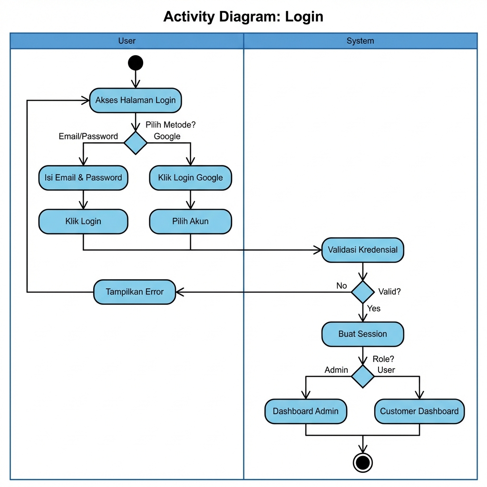

### Deskripsi Alur:
1. User mengakses halaman login
2. User memilih metode login (Email/Password atau Google OAuth)
3. Sistem memvalidasi kredensial
4. Jika valid, sistem membuat session dan redirect ke dashboard sesuai role
5. Jika invalid, tampilkan pesan error

---

## 2️⃣ Activity Diagram: Register Pelanggan

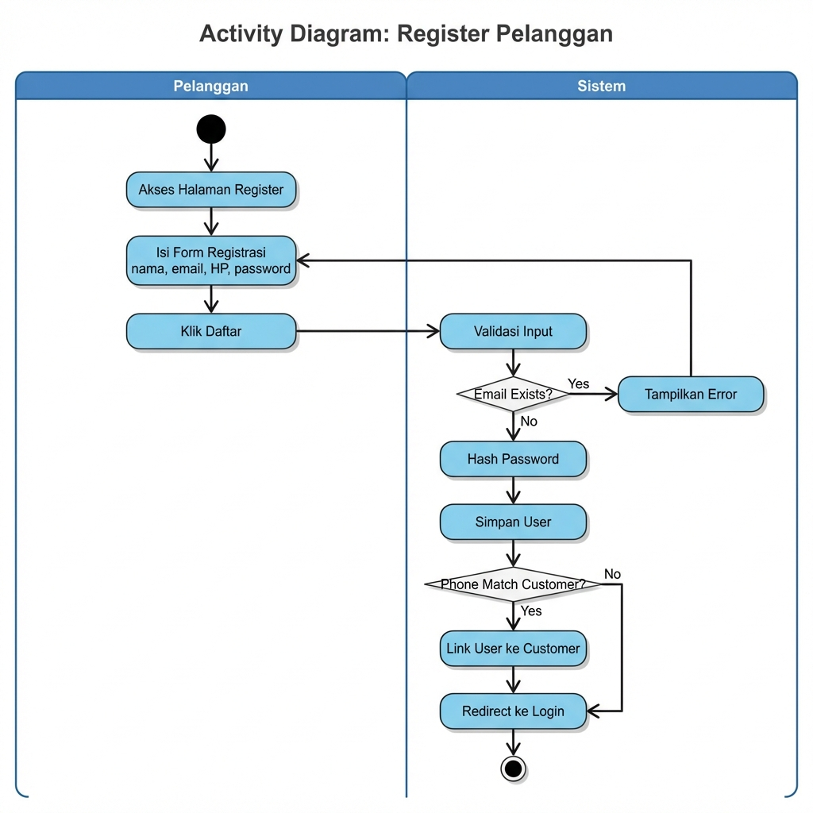

### Deskripsi Alur:
1. Pelanggan mengakses halaman register
2. Pelanggan mengisi form (nama, email, HP, password)
3. Sistem memvalidasi input dan cek email exists
4. Jika email baru, hash password dan simpan user
5. Sistem auto-link customer jika phone cocok
6. Redirect ke halaman login

---

## 3️⃣ Activity Diagram: Tambah Data Pelanggan

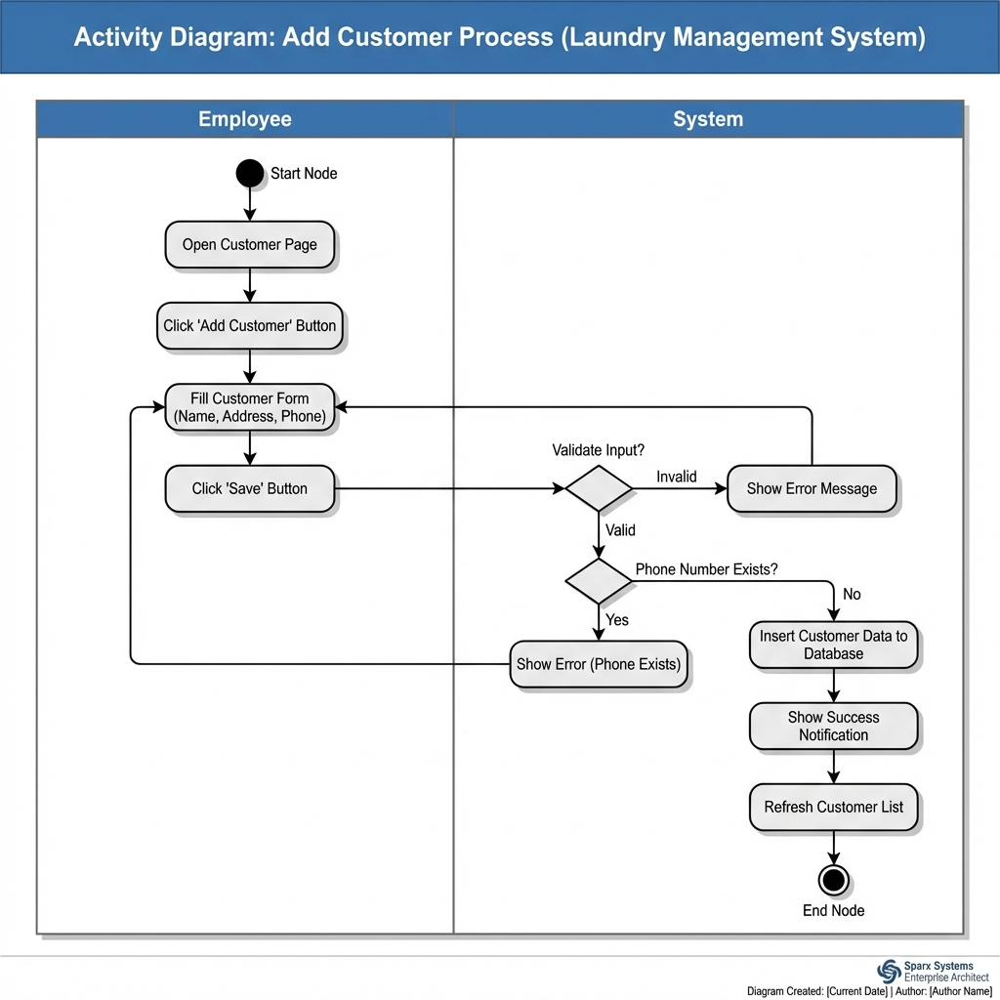

### Deskripsi Alur:
1. Karyawan membuka halaman pelanggan
2. Klik tombol "Tambah Pelanggan"
3. Mengisi form data pelanggan (nama, alamat, nomor HP)
4. Sistem memvalidasi input (required fields, format HP)
5. Sistem mengecek apakah nomor HP sudah terdaftar
6. Jika valid dan unik, data disimpan ke database
7. Tampilkan notifikasi sukses dan refresh daftar

---

## 4️⃣ Activity Diagram: Lihat Data Pelanggan

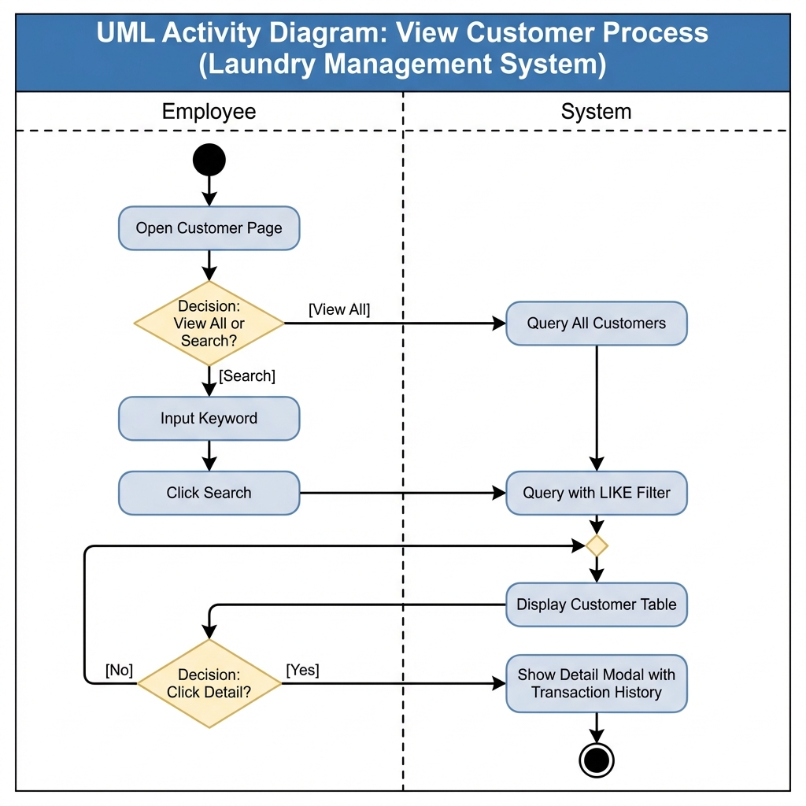

### Deskripsi Alur:
1. Karyawan membuka halaman pelanggan
2. Sistem menampilkan daftar semua pelanggan
3. Karyawan dapat mencari pelanggan dengan keyword
4. Karyawan dapat melihat detail pelanggan
5. Detail pelanggan menampilkan info lengkap + riwayat transaksi

---

## 5️⃣ Activity Diagram: Edit Data Pelanggan

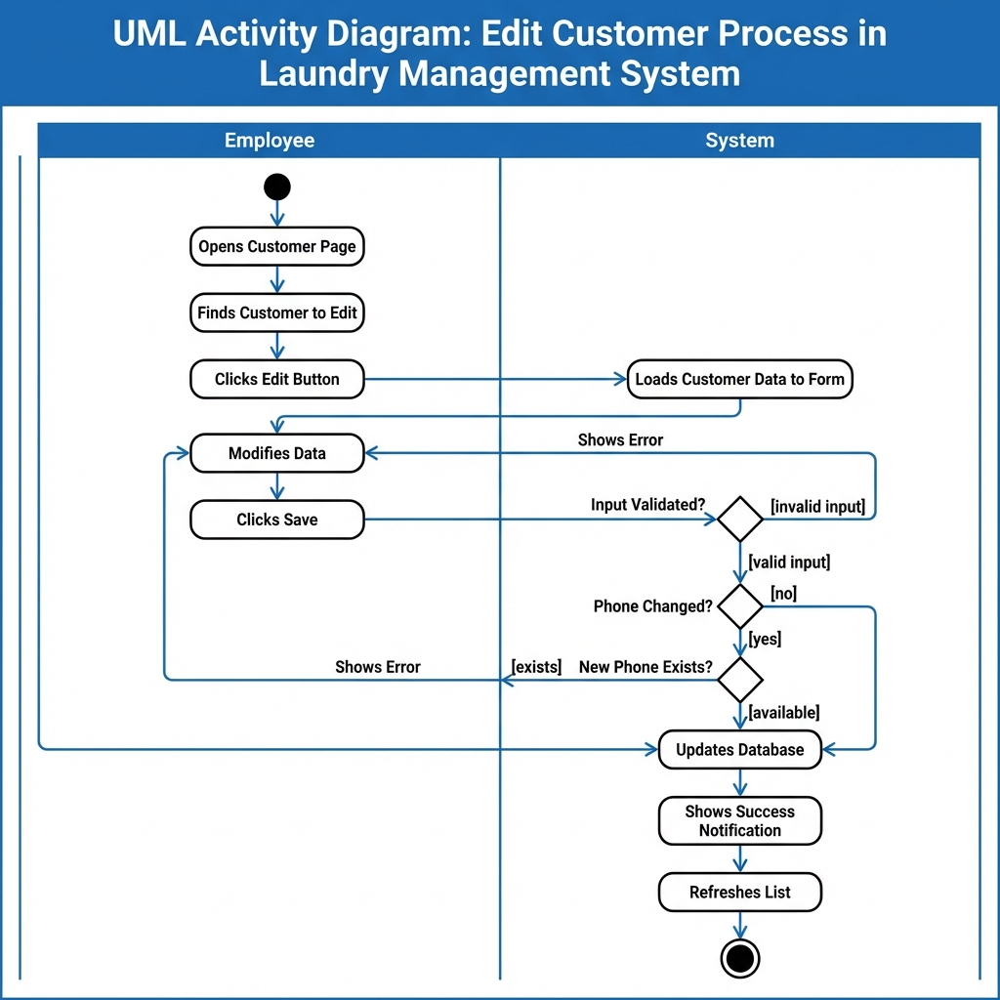

### Deskripsi Alur:
1. Karyawan mencari pelanggan yang akan diedit
2. Klik tombol edit, form terisi dengan data existing
3. Karyawan mengubah data yang diperlukan
4. Sistem memvalidasi perubahan
5. Jika nomor HP berubah, sistem mengecek keunikan
6. Data di-update ke database
7. Tampilkan notifikasi sukses dan refresh daftar

---

## 6️⃣ Activity Diagram: Hapus Data Pelanggan

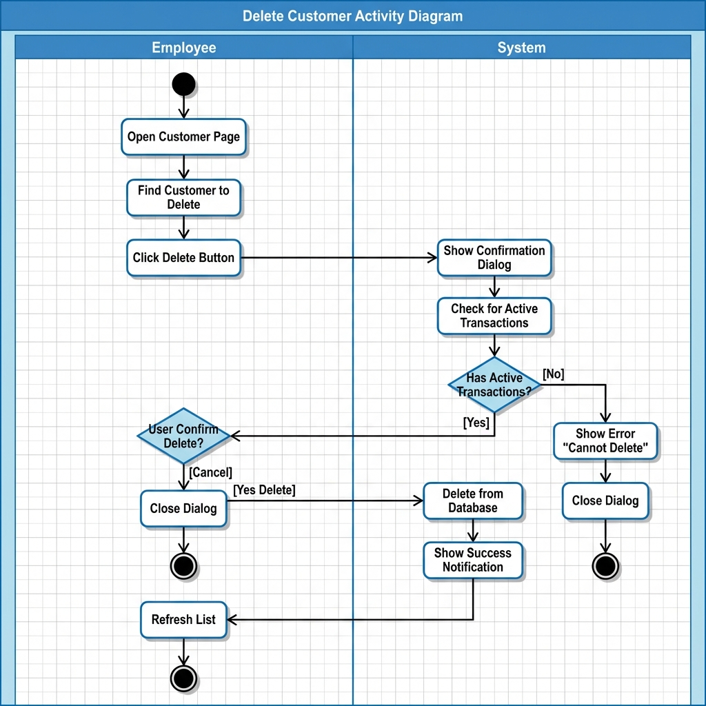

### Deskripsi Alur:
1. Karyawan mencari pelanggan yang akan dihapus
2. Klik tombol hapus
3. Sistem mengecek apakah pelanggan memiliki transaksi aktif
4. Jika ada transaksi, penghapusan ditolak
5. Jika tidak ada transaksi, tampilkan konfirmasi
6. Jika dikonfirmasi, data dihapus dari database
7. Tampilkan notifikasi sukses dan refresh daftar

---

## 7️⃣ Activity Diagram: Mencatat Transaksi Baru

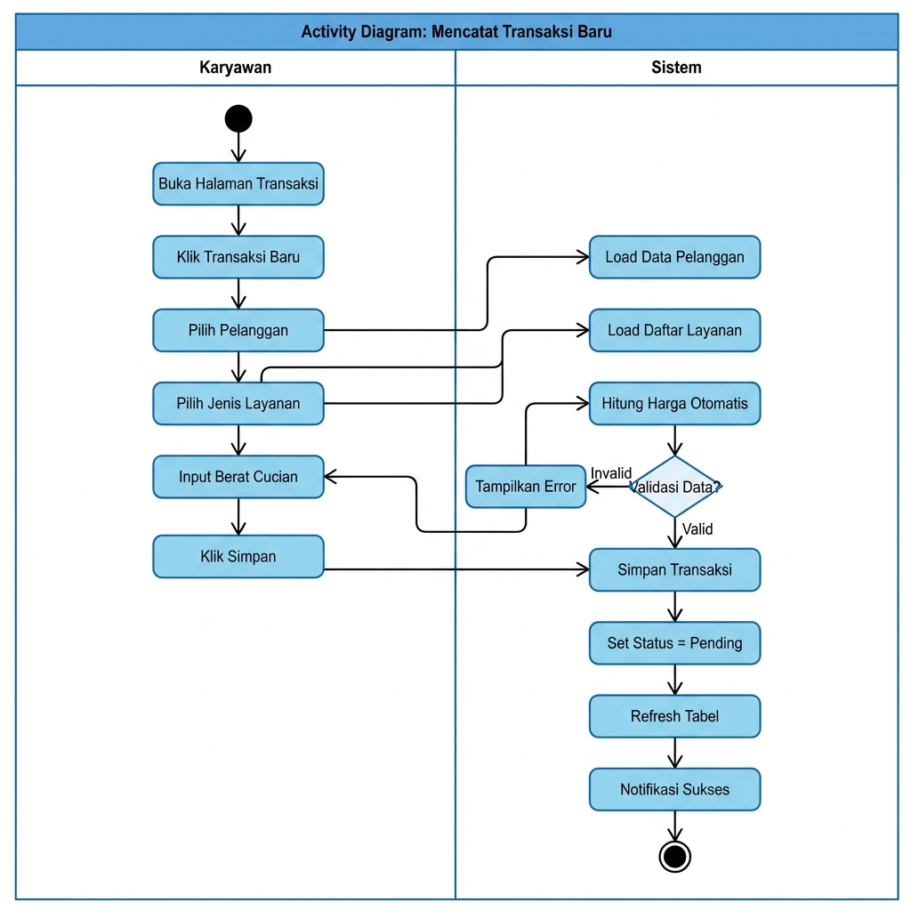

### Deskripsi Alur:
1. Karyawan buka halaman transaksi
2. Klik "Transaksi Baru"
3. Pilih pelanggan, layanan, input berat
4. Sistem hitung harga otomatis
5. Karyawan simpan transaksi
6. Sistem set status = pending

---

## 8️⃣ Activity Diagram: Update Status Transaksi

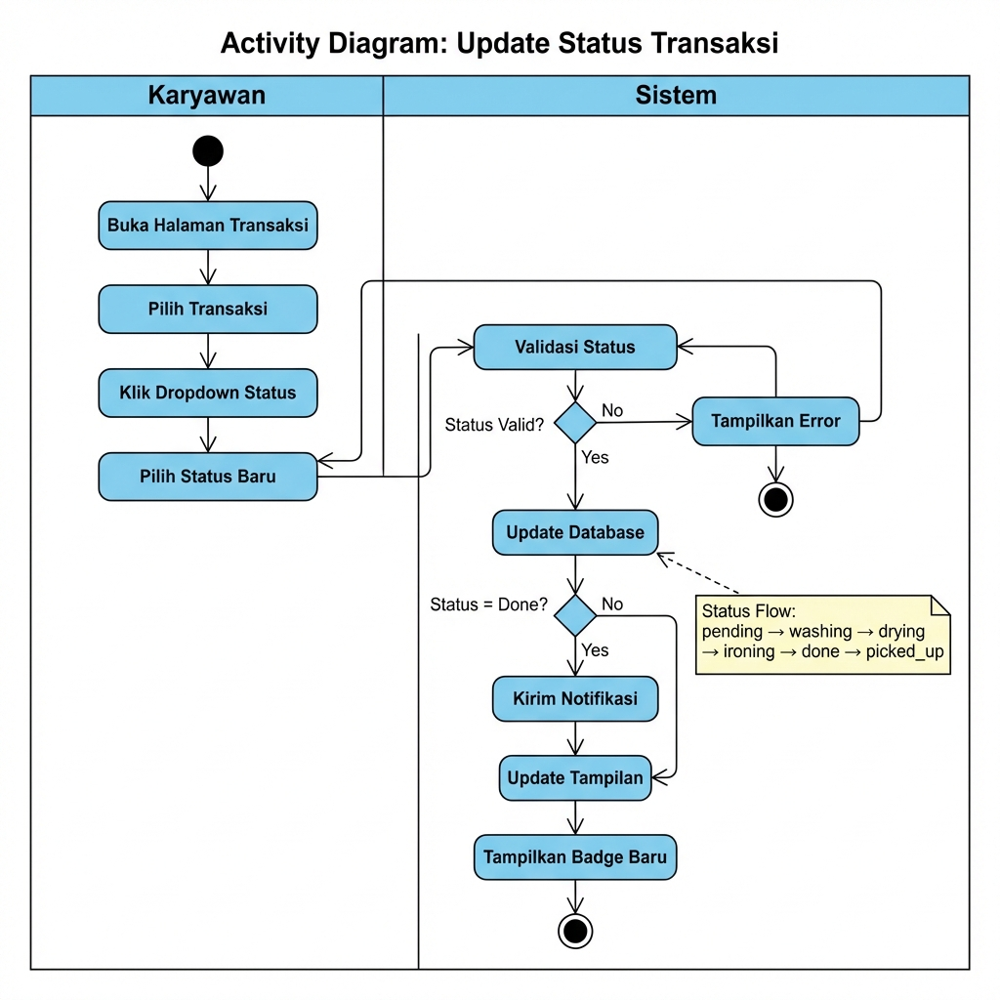

### Deskripsi Alur:
1. Karyawan pilih transaksi
2. Klik dropdown status, pilih status baru
3. Sistem validasi status
4. Jika status = done, kirim notifikasi ke pelanggan
5. Update tampilan dengan badge baru

### Alur Status Valid:
```
pending → washing → drying → ironing → done → picked_up
```

---

## 9️⃣ Activity Diagram: Cek Status Order (Pelanggan)

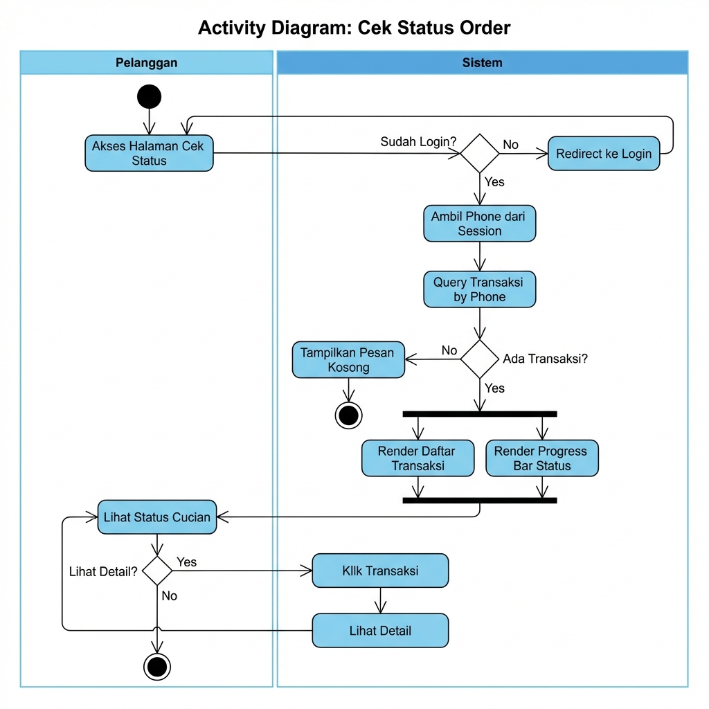

### Deskripsi Alur:
1. Pelanggan akses halaman cek status
2. Sistem cek login, jika belum redirect ke login
3. Jika sudah login, ambil phone dari session
4. Query transaksi berdasarkan phone
5. Tampilkan daftar transaksi dengan progress bar

---

## 🔟 Activity Diagram: Mencetak Nota (TODO)

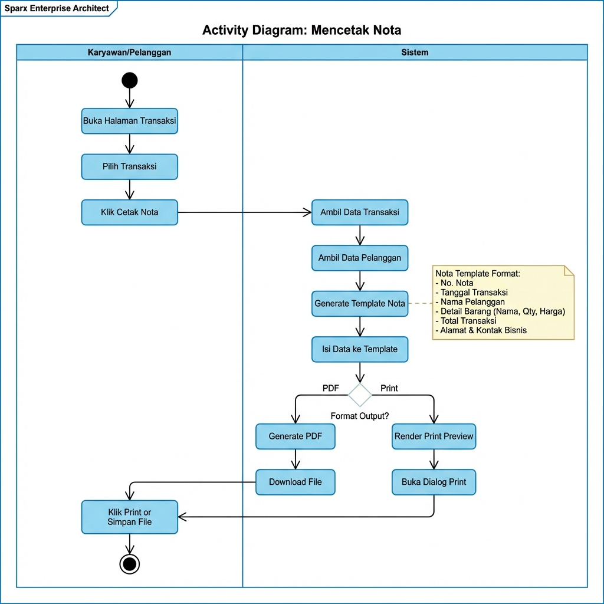

### Deskripsi Alur:
1. User pilih transaksi, klik cetak nota
2. Sistem ambil data transaksi dan pelanggan
3. Generate template nota dengan data
4. User pilih format (PDF/Print)
5. Download file atau buka dialog print

### Template Nota:
```
┌─────────────────────────────────────┐
│       D'FOUR SMART LAUNDRY          │
│      Jl. Contoh No. 123             │
├─────────────────────────────────────┤
│ No. Transaksi: TRX-001              │
│ Tanggal      : 11 Jan 2026          │
├─────────────────────────────────────┤
│ Pelanggan    : Budi Santoso         │
│ Telepon      : 0812-xxxx-xxxx       │
├─────────────────────────────────────┤
│ Layanan      : Cuci Setrika         │
│ Berat        : 5 Kg                 │
│ TOTAL        : Rp 35.000            │
└─────────────────────────────────────┘
```

---

## 1️⃣1️⃣ Activity Diagram: Laporan Bulanan (TODO)

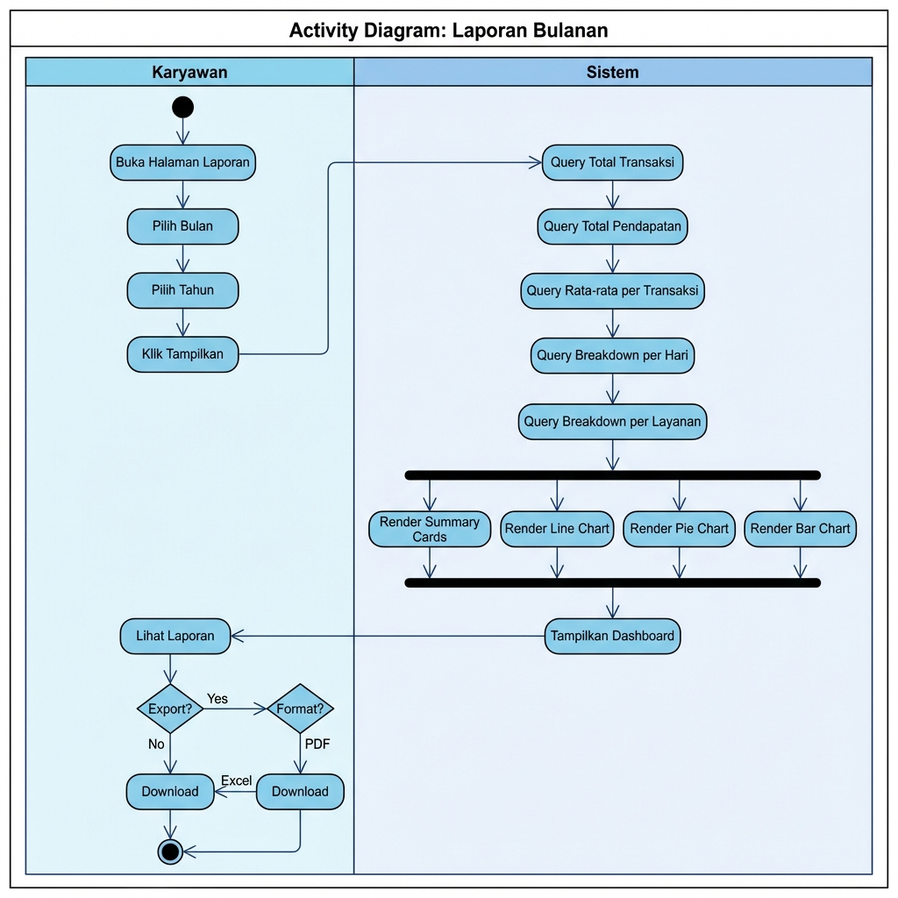

### Deskripsi Alur:
1. Karyawan buka halaman laporan
2. Pilih bulan dan tahun, klik tampilkan
3. Sistem query data (total transaksi, pendapatan, breakdown)
4. Render charts (line, pie, bar) secara paralel
5. Tampilkan dashboard laporan
6. Karyawan dapat export ke Excel/PDF

### Data Laporan:
| Metrik | Deskripsi |
|--------|-----------|
| Total Transaksi | Jumlah transaksi dalam periode |
| Total Pendapatan | Sum(price) dalam periode |
| Rata-rata per Transaksi | AVG(price) |
| Transaksi per Hari | Group by DATE(created_at) |

---

## 1️⃣3️⃣ Activity Diagram: Pembayaran (Midtrans/Manual)

### Deskripsi Alur Pembayaran:

**Swimlane: Pelanggan | Sistem | Midtrans API**

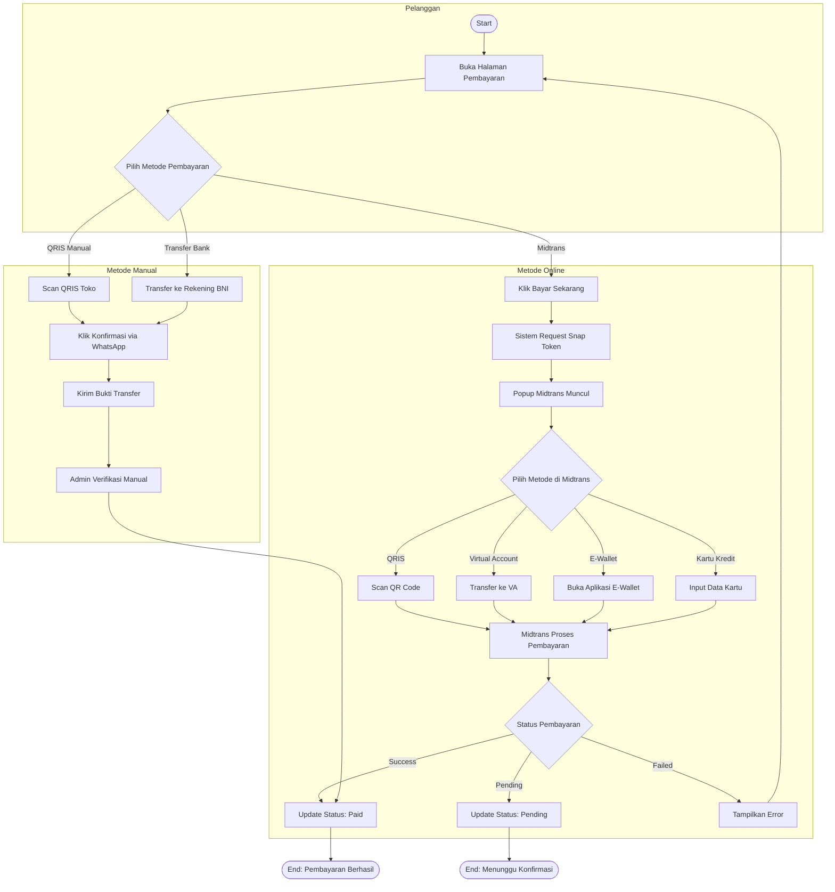
```mermaid
flowchart TD
    subgraph Pelanggan
        A([Start]) --> B[Buka Halaman Pembayaran]
        B --> C{Pilih Metode Pembayaran}
    end
    
    subgraph "Metode Online"
        C -->|Midtrans| D[Klik Bayar Sekarang]
        D --> E[Sistem Request Snap Token]
        E --> F[Popup Midtrans Muncul]
        F --> G{Pilih Metode di Midtrans}
        G -->|QRIS| H1[Scan QR Code]
        G -->|Virtual Account| H2[Transfer ke VA]
        G -->|E-Wallet| H3[Buka Aplikasi E-Wallet]
        G -->|Kartu Kredit| H4[Input Data Kartu]
        H1 --> I[Midtrans Proses Pembayaran]
        H2 --> I
        H3 --> I
        H4 --> I
        I --> J{Status Pembayaran}
        J -->|Success| K[Update Status: Paid]
        J -->|Pending| L[Update Status: Pending]
        J -->|Failed| M[Tampilkan Error]
    end
    
    subgraph "Metode Manual"
        C -->|QRIS Manual| N[Scan QRIS Toko]
        C -->|Transfer Bank| O[Transfer ke Rekening BNI]
        N --> P[Klik Konfirmasi via WhatsApp]
        O --> P
        P --> Q[Kirim Bukti Transfer]
        Q --> R[Admin Verifikasi Manual]
        R --> K
    end
    
    K --> S([End: Pembayaran Berhasil])
    L --> T([End: Menunggu Konfirmasi])
    M --> B
```

### Alur Detail:

**1. Pembayaran Online (Midtrans):**
1. Pelanggan login dan buka halaman `/pages/payment.php`
2. Pilih transaksi yang belum dibayar
3. Klik "Bayar Sekarang"
4. Sistem request Snap Token ke Midtrans API
5. Popup Midtrans muncul dengan opsi pembayaran
6. Pelanggan pilih metode (QRIS, VA, E-Wallet, Kartu)
7. Ikuti instruksi pembayaran
8. Midtrans callback status ke `api/payment/notification.php`
9. Sistem update status transaksi

**2. Pembayaran Manual (QRIS/Transfer):**
1. Pelanggan lihat QRIS atau info rekening bank
2. Scan QRIS atau transfer ke rekening
3. Klik "Konfirmasi via WhatsApp"
4. Kirim bukti transfer ke admin
5. Admin verifikasi dan update status manual

### File Terkait:
| Komponen | File |
|----------|------|
| Halaman Pembayaran | `pages/payment.php` |
| Invoice/Nota | `pages/invoice.php`, `includes/invoice-template.php` |
| Create Snap Token | `api/payment/create-snap.php` |
| Webhook Handler | `api/payment/notification.php` |
| Cek Status | `api/payment/check-status.php` |
| Konfigurasi Midtrans | `config/midtrans.php` |
| Info Pembayaran Manual | `config/payment-info.php` |

---

## 1️⃣2️⃣ Activity Diagram: Alur Transaksi Lengkap

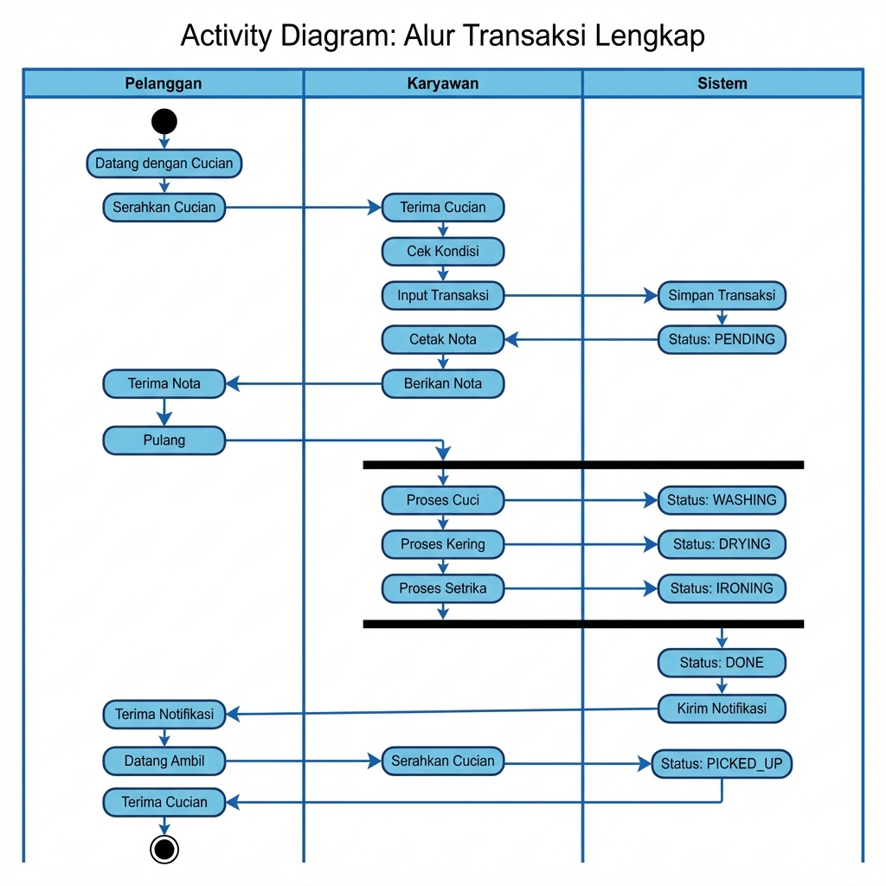

### Deskripsi Alur End-to-End:

**Fase 1 - Penerimaan:**
1. Pelanggan datang dengan cucian
2. Karyawan terima dan input transaksi
3. Sistem simpan dengan status PENDING
4. Karyawan cetak dan berikan nota

**Fase 2 - Pengerjaan:**
5. Proses cuci → Status: WASHING
6. Proses keringkan → Status: DRYING
7. Proses setrika → Status: IRONING
8. Selesai → Status: DONE
9. Sistem kirim notifikasi ke pelanggan

**Fase 3 - Pengambilan:**
10. Pelanggan datang ambil cucian
11. Karyawan serahkan cucian
12. Update status → PICKED_UP

---

## 📝 Catatan

1. **Implemented (✅)**: Fitur sudah ada di codebase
2. **TODO (🚧)**: Fitur dalam tahap pengembangan (lihat `docs/to-do.md`)
3. Gambar menggunakan format standar **Sparx Enterprise Architect**

### Referensi File:

| Activity | File Terkait |
|----------|--------------|
| Login | `pages/auth/login.php` |
| Register | `pages/auth/register.php` |
| Kelola Pelanggan | `pages/customers.php`, `api/customers-api.php` |
| Transaksi | `pages/transactions.php`, `api/transactions-api.php` |
| Cek Status | `pages/check-order.php` |
| Cetak Nota | `pages/print-receipt.php` (TODO) |
| Laporan | `pages/reports.php` (TODO) |

---

*Dokumen ini berdasarkan analisis codebase D'four Smart Laundry System*
