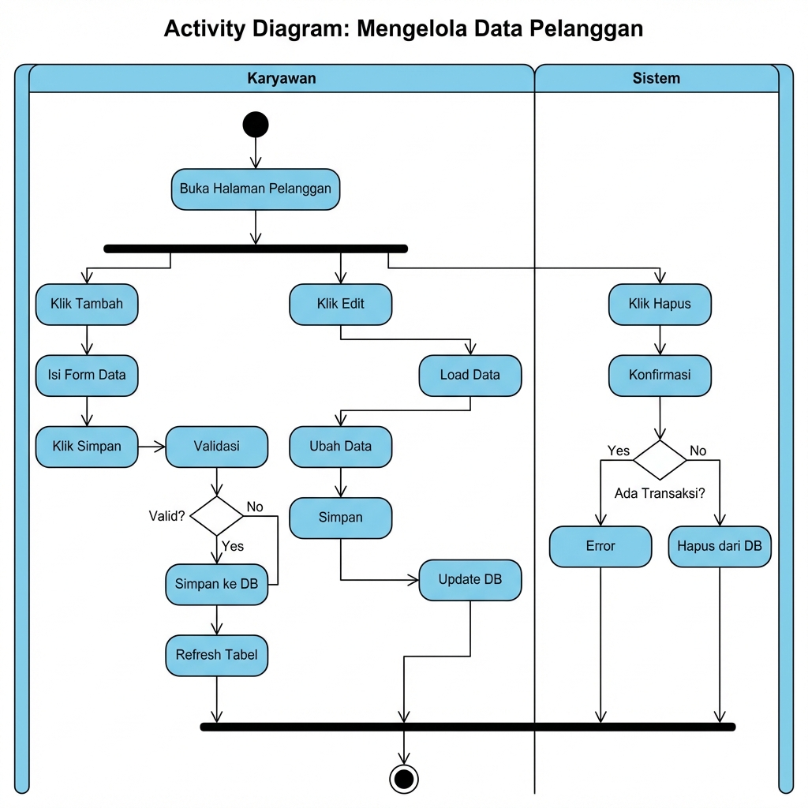

# 📊 Activity Diagram - D'four Smart Laundry System

**Versi**: 1.1  
**Tanggal**: 2026-01-11  
**Status**: Berdasarkan fitur yang sudah ada dan sedang dikembangkan

---

## 📋 Daftar Activity Diagram

| # | Diagram | Status | Gambar |
|---|---------|--------|--------|
| 1 | Login (Email & Google OAuth) | ✅ Implemented | ✅ |
| 2 | Register Pelanggan | ✅ Implemented | ✅ |
| 3 | Mengelola Data Pelanggan | ✅ Implemented | ✅ |
| 4 | Mencatat Transaksi Baru | ✅ Implemented | ✅ |
| 5 | Update Status Transaksi | ✅ Implemented | ✅ |
| 6 | Cek Status Order (Pelanggan) | ✅ Implemented | ✅ |
| 7 | Mencetak Nota | 🚧 TODO | ✅ |
| 8 | Laporan Bulanan | 🚧 TODO | ✅ |
| 9 | Alur Transaksi Lengkap | ✅ Overview | ✅ |

---

## 📖 Keterangan Simbol Activity Diagram

| Simbol | Nama | Deskripsi |
|--------|------|-----------|
| ⚫ | Initial Node | Titik awal aktivitas |
| ◉ | Final Node | Titik akhir aktivitas |
| ▭ | Action/Activity | Proses atau aksi yang dilakukan |
| ◇ | Decision | Percabangan keputusan |
| ═ | Fork/Join | Pemisahan/penggabungan aktivitas paralel |
| ▭▭ | Swimlane | Pembagian berdasarkan aktor/sistem |

---

## 1️⃣ Activity Diagram: Login


### Deskripsi Alur:
1. User mengakses halaman login
2. User memilih metode login (Email/Password atau Google OAuth)
3. Sistem memvalidasi kredensial
4. Jika valid, sistem membuat session dan redirect ke dashboard sesuai role
5. Jika invalid, tampilkan pesan error

---

## 2️⃣ Activity Diagram: Register Pelanggan


### Deskripsi Alur:
1. Pelanggan mengakses halaman register
2. Pelanggan mengisi form (nama, email, HP, password)
3. Sistem memvalidasi input dan cek email exists
4. Jika email baru, hash password dan simpan user
5. Sistem auto-link customer jika phone cocok
6. Redirect ke halaman login

---

## 3️⃣ Activity Diagram: Mengelola Data Pelanggan (CRUD)



### Deskripsi Alur:
**Tambah Pelanggan:**
1. Karyawan klik tambah → isi form → simpan
2. Sistem validasi dan simpan ke database

**Edit Pelanggan:**
1. Karyawan klik edit → ubah data → simpan
2. Sistem update database

**Hapus Pelanggan:**
1. Karyawan klik hapus → konfirmasi
2. Sistem cek transaksi, jika ada maka tolak, jika tidak maka hapus

---

## 4️⃣ Activity Diagram: Mencatat Transaksi Baru


### Deskripsi Alur:
1. Karyawan buka halaman transaksi
2. Klik "Transaksi Baru"
3. Pilih pelanggan, layanan, input berat
4. Sistem hitung harga otomatis
5. Karyawan simpan transaksi
6. Sistem set status = pending

---

## 5️⃣ Activity Diagram: Update Status Transaksi


### Deskripsi Alur:
1. Karyawan pilih transaksi
2. Klik dropdown status, pilih status baru
3. Sistem validasi status
4. Jika status = done, kirim notifikasi ke pelanggan
5. Update tampilan dengan badge baru

### Alur Status Valid:
```
pending → washing → drying → ironing → done → picked_up
```

---

## 6️⃣ Activity Diagram: Cek Status Order (Pelanggan)


### Deskripsi Alur:
1. Pelanggan akses halaman cek status
2. Sistem cek login, jika belum redirect ke login
3. Jika sudah login, ambil phone dari session
4. Query transaksi berdasarkan phone
5. Tampilkan daftar transaksi dengan progress bar

---

## 7️⃣ Activity Diagram: Mencetak Nota (TODO)


### Deskripsi Alur:
1. User pilih transaksi, klik cetak nota
2. Sistem ambil data transaksi dan pelanggan
3. Generate template nota dengan data
4. User pilih format (PDF/Print)
5. Download file atau buka dialog print

### Template Nota:
```
┌─────────────────────────────────────┐
│       D'FOUR SMART LAUNDRY          │
│      Jl. Contoh No. 123             │
├─────────────────────────────────────┤
│ No. Transaksi: TRX-001              │
│ Tanggal      : 11 Jan 2026          │
├─────────────────────────────────────┤
│ Pelanggan    : Budi Santoso         │
│ Telepon      : 0812-xxxx-xxxx       │
├─────────────────────────────────────┤
│ Layanan      : Cuci Setrika         │
│ Berat        : 5 Kg                 │
│ TOTAL        : Rp 35.000            │
└─────────────────────────────────────┘
```

---

## 8️⃣ Activity Diagram: Laporan Bulanan (TODO)


### Deskripsi Alur:
1. Karyawan buka halaman laporan
2. Pilih bulan dan tahun, klik tampilkan
3. Sistem query data (total transaksi, pendapatan, breakdown)
4. Render charts (line, pie, bar) secara paralel
5. Tampilkan dashboard laporan
6. Karyawan dapat export ke Excel/PDF

### Data Laporan:
| Metrik | Deskripsi |
|--------|-----------|
| Total Transaksi | Jumlah transaksi dalam periode |
| Total Pendapatan | Sum(price) dalam periode |
| Rata-rata per Transaksi | AVG(price) |
| Transaksi per Hari | Group by DATE(created_at) |

---

## 9️⃣ Activity Diagram: Alur Transaksi Lengkap


### Deskripsi Alur End-to-End:

**Fase 1 - Penerimaan:**
1. Pelanggan datang dengan cucian
2. Karyawan terima dan input transaksi
3. Sistem simpan dengan status PENDING
4. Karyawan cetak dan berikan nota

**Fase 2 - Pengerjaan:**
5. Proses cuci → Status: WASHING
6. Proses keringkan → Status: DRYING
7. Proses setrika → Status: IRONING
8. Selesai → Status: DONE
9. Sistem kirim notifikasi ke pelanggan

**Fase 3 - Pengambilan:**
10. Pelanggan datang ambil cucian
11. Karyawan serahkan cucian
12. Update status → PICKED_UP

---

## 📝 Catatan

1. **Implemented (✅)**: Fitur sudah ada di codebase
2. **TODO (🚧)**: Fitur dalam tahap pengembangan (lihat `docs/to-do.md`)
3. Gambar menggunakan format standar **Sparx Enterprise Architect**

### Referensi File:

| Activity | File Terkait |
|----------|--------------|
| Login | `pages/auth/login.php` |
| Register | `pages/auth/register.php` |
| Kelola Pelanggan | `pages/customers.php`, `api/customers-api.php` |
| Transaksi | `pages/transactions.php`, `api/transactions-api.php` |
| Cek Status | `pages/check-order.php` |
| Cetak Nota | `pages/print-receipt.php` (TODO) |
| Laporan | `pages/reports.php` (TODO) |

---

*Dokumen ini berdasarkan analisis codebase D'four Smart Laundry System*
