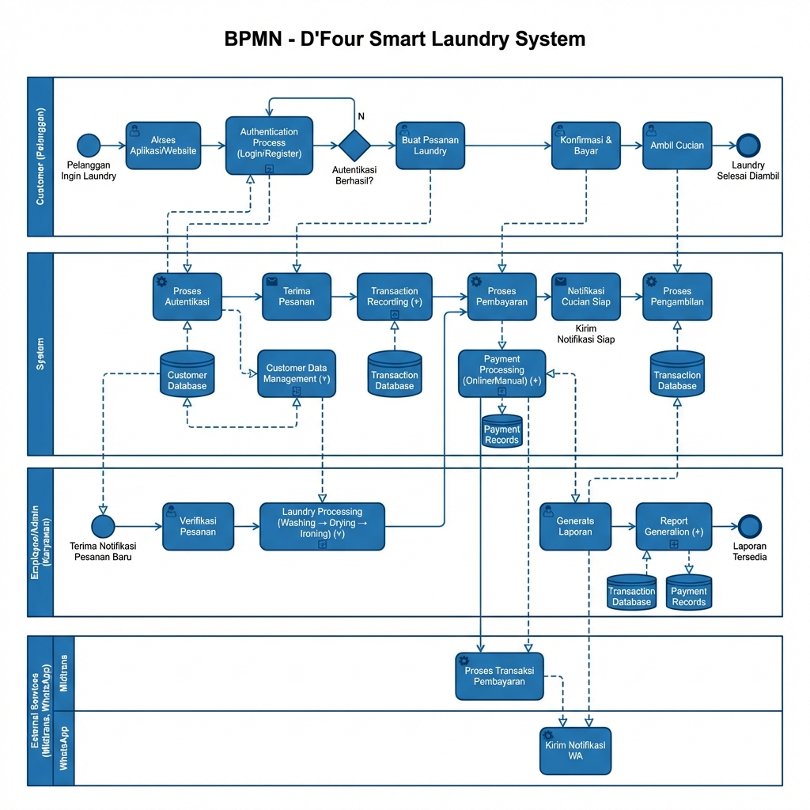
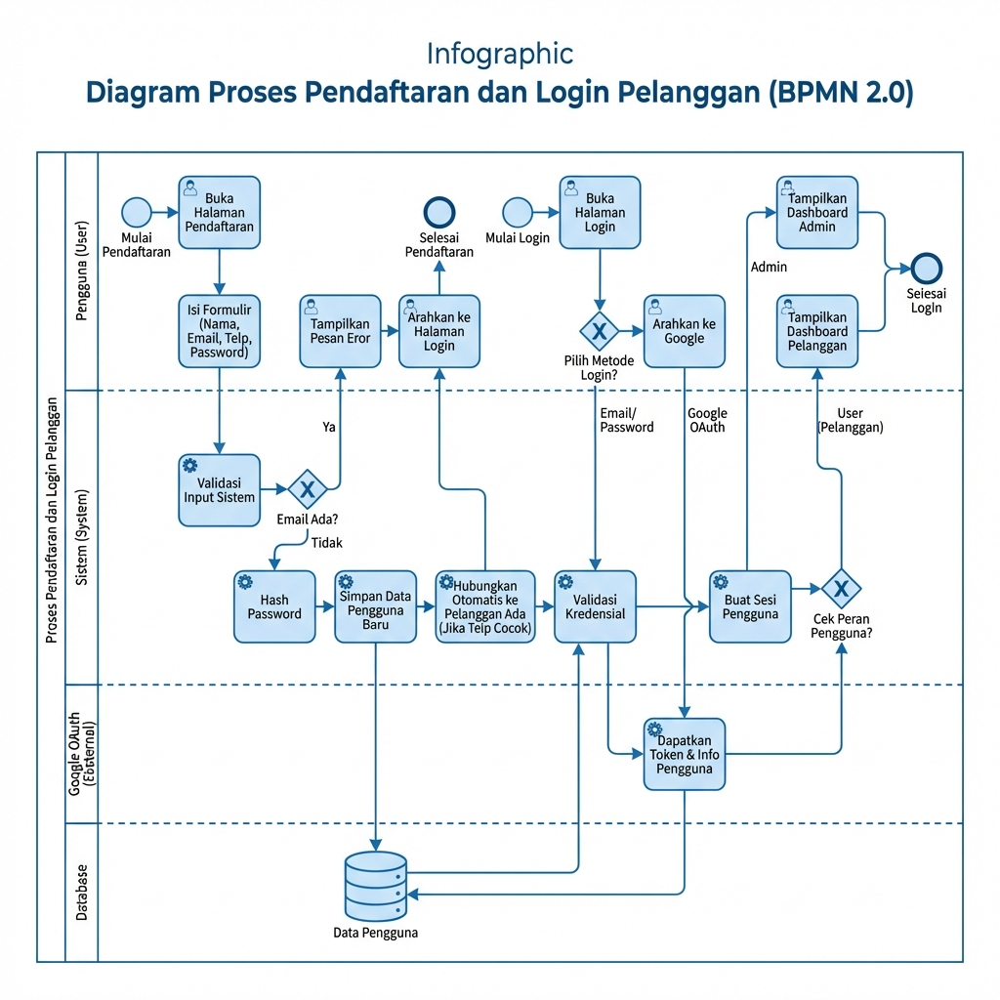
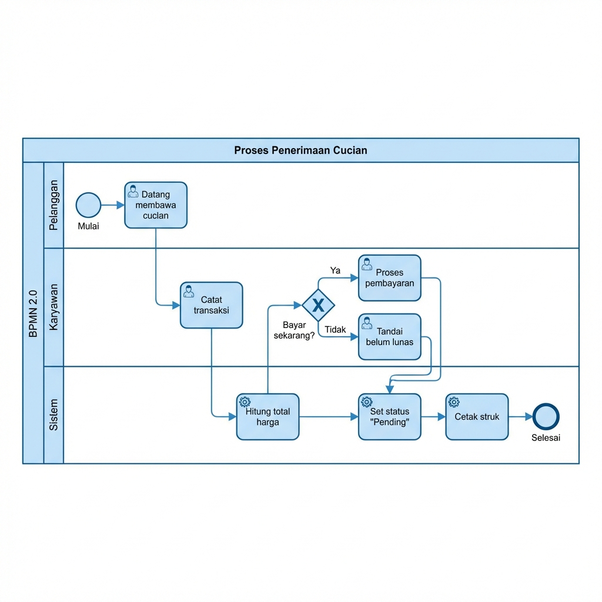
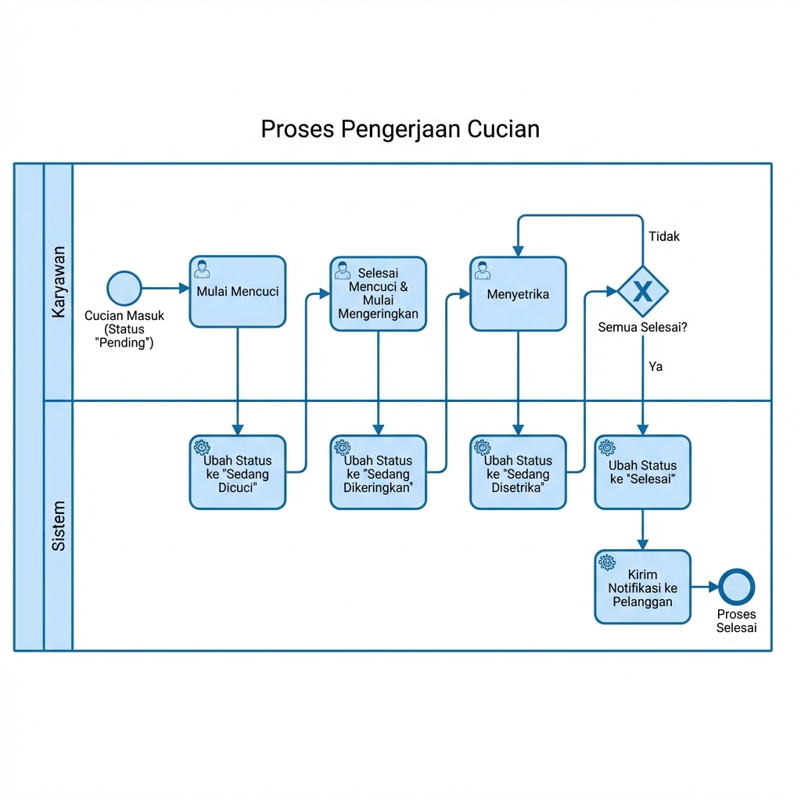
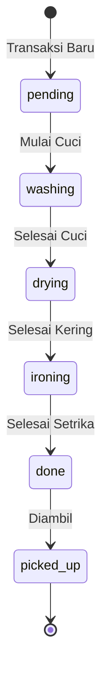
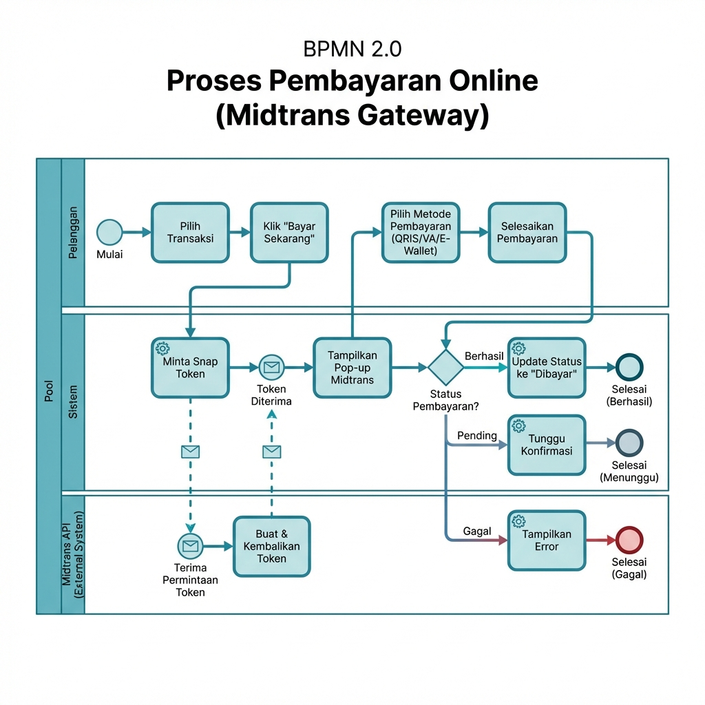
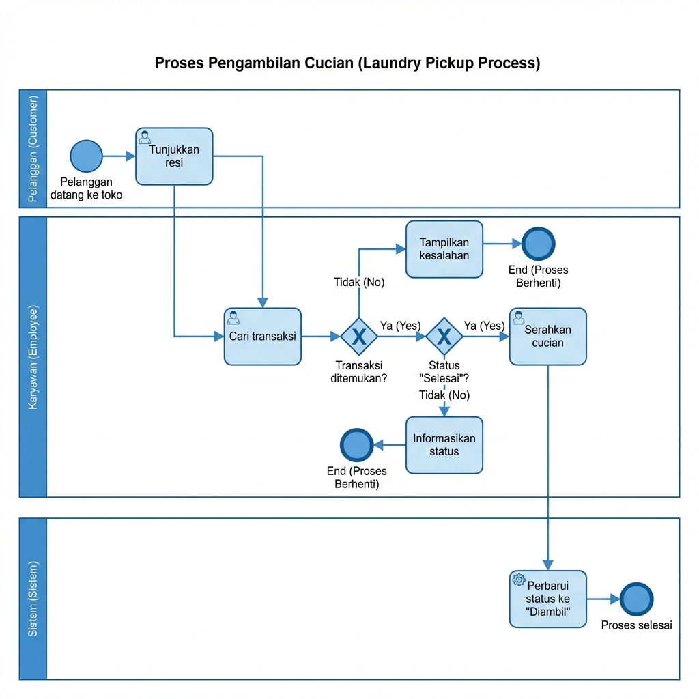

# 📊 BPMN Diagram - D'Four Smart Laundry System

**Versi**: 1.0  
**Tanggal**: 2026-01-17  
**Standar**: BPMN 2.0 (Business Process Model and Notation)

---

## 📋 Daftar BPMN Diagram

| # | Diagram | Deskripsi | Status |
|---|---------|-----------|--------|
| 1 | Overview Sistem | Gambaran umum seluruh proses bisnis | ✅ |
| 2 | Proses Autentikasi | Login & Register pelanggan | ✅ |
| 3 | Proses Penerimaan Cucian | Pencatatan transaksi baru | ✅ |
| 4 | Proses Pengerjaan Cucian | Alur pengerjaan laundry | ✅ |
| 5 | Proses Pembayaran Online | Pembayaran via Midtrans | ✅ |
| 6 | Proses Pengambilan Cucian | Pickup laundry oleh pelanggan | ✅ |

---

## 📖 Keterangan Notasi BPMN 2.0

### Event (Kejadian)

| Simbol | Nama | Deskripsi |
|--------|------|-----------|
| ⚪ | Start Event | Titik awal proses |
| ⬤ | End Event | Titik akhir proses |
| ✉️ | Message Event | Event yang dipicu oleh pesan |
| ⏰ | Timer Event | Event yang dipicu oleh waktu |

### Activity (Aktivitas)

| Simbol | Nama | Deskripsi |
|--------|------|-----------|
| 👤▢ | User Task | Tugas yang dilakukan oleh manusia |
| ⚙️▢ | Service Task | Tugas otomatis oleh sistem |
| +▢ | Sub-Process | Proses yang dikelompokkan |
| ↻▢ | Loop Task | Tugas yang berulang |

### Gateway (Percabangan)

| Simbol | Nama | Deskripsi |
|--------|------|-----------|
| ◇✕ | Exclusive Gateway | Pilih satu jalur (XOR) |
| ◇+ | Parallel Gateway | Semua jalur dieksekusi (AND) |
| ◇○ | Inclusive Gateway | Pilih satu atau lebih jalur (OR) |

### Swimlane (Peran)

| Elemen | Deskripsi |
|--------|-----------|
| **Pool** | Mewakili organisasi atau sistem utama |
| **Lane** | Mewakili peran/aktor dalam pool |

### Connector (Penghubung)

| Simbol | Nama | Deskripsi |
|--------|------|-----------|
| → | Sequence Flow | Alur urutan aktivitas |
| ⇢ (dashed) | Message Flow | Alur pesan antar pool |
| ⋯ | Association | Hubungan dengan data/artefak |

---

## 1️⃣ BPMN Overview: D'Four Smart Laundry System



### Deskripsi Proses Bisnis Utama

Diagram ini menggambarkan proses bisnis lengkap dari sistem D'Four Smart Laundry yang melibatkan:

**Pool & Lanes:**
| Pool | Lane | Deskripsi |
|------|------|-----------|
| **Customer (Pelanggan)** | - | Pengguna layanan laundry |
| **System** | - | Sistem aplikasi D'Four |
| **Employee (Karyawan)** | - | Staff operasional laundry |
| **External Services** | Midtrans | Payment gateway online |
| **External Services** | WhatsApp | Notifikasi & konfirmasi |

**Sub-Process yang Tercakup:**
1. **Authentication Process** - Login/Register
2. **Customer Data Management** - Kelola data pelanggan
3. **Transaction Recording** - Pencatatan transaksi
4. **Laundry Processing** - Washing → Drying → Ironing
5. **Payment Processing** - Online & Manual
6. **Order Pickup** - Pengambilan cucian
7. **Report Generation** - Pembuatan laporan

**Data Store:**
- Customer Database
- Transaction Database
- Payment Records

---

## 2️⃣ BPMN: Proses Autentikasi (Login & Register)



### Deskripsi Proses

Diagram ini menggambarkan dua proses utama dalam autentikasi:

#### A. Proses Pendaftaran (Registration)

| Step | Aktivitas | Aktor | Tipe |
|------|-----------|-------|------|
| 1 | Buka halaman pendaftaran | User | User Task |
| 2 | Isi formulir (nama, email, telp, password) | User | User Task |
| 3 | Validasi input sistem | System | Service Task |
| 4 | Cek email sudah ada? | System | Exclusive Gateway |
| 5a | Email ada → Tampilkan error | System | Service Task |
| 5b | Email baru → Hash password | System | Service Task |
| 6 | Simpan data pengguna baru | Database | Service Task |
| 7 | Hubungkan otomatis ke pelanggan (jika telp cocok) | System | Service Task |
| 8 | Arahkan ke halaman login | System | Service Task |

#### B. Proses Login

| Step | Aktivitas | Aktor | Tipe |
|------|-----------|-------|------|
| 1 | Buka halaman login | User | User Task |
| 2 | Pilih metode login | User | Exclusive Gateway |
| 3a | Email/Password → Validasi kredensial | System | Service Task |
| 3b | Google OAuth → Arahkan ke Google | Google OAuth | Service Task |
| 4 | Dapatkan token & info pengguna | Google OAuth | Service Task |
| 5 | Buat sesi pengguna | System | Service Task |
| 6 | Cek peran pengguna | System | Exclusive Gateway |
| 7a | Admin → Dashboard Admin | System | End Event |
| 7b | User → Dashboard Pelanggan | System | End Event |

### File Terkait

| Komponen | File |
|----------|------|
| Halaman Login | `pages/auth/login.php` |
| Halaman Register | `pages/auth/register.php` |
| Auth Handler | `includes/auth.php` |
| Google OAuth Config | `config/google-oauth.php` |

---

## 3️⃣ BPMN: Proses Penerimaan Cucian



### Deskripsi Proses

Proses penerimaan cucian dari pelanggan hingga transaksi tercatat:

| Step | Aktivitas | Swimlane | Tipe |
|------|-----------|----------|------|
| 1 | Pelanggan datang membawa cucian | Pelanggan | Start Event |
| 2 | Catat transaksi (pilih pelanggan, layanan, berat) | Karyawan | User Task |
| 3 | Hitung total harga otomatis | Sistem | Service Task |
| 4 | Bayar sekarang? | Karyawan | Exclusive Gateway |
| 5a | Ya → Proses pembayaran | Karyawan | User Task |
| 5b | Tidak → Tandai belum lunas | Karyawan | Service Task |
| 6 | Set status "Pending" | Sistem | Service Task |
| 7 | Cetak struk | Sistem | Service Task |
| 8 | Proses selesai | Sistem | End Event |

### Business Rules

```
IF pembayaran_langsung == TRUE
    payment_status = 'paid'
    payment_method = 'cash'
ELSE
    payment_status = 'unpaid'
    
transaction_status = 'pending'
```

### File Terkait

| Komponen | File |
|----------|------|
| Halaman Transaksi | `pages/transactions.php` |
| API Transaksi | `api/transactions-api.php` |
| Template Invoice | `includes/invoice-template.php` |

---

## 4️⃣ BPMN: Proses Pengerjaan Cucian



### Deskripsi Proses

Alur pengerjaan cucian dari status "Pending" hingga "Selesai":

| Step | Aktivitas | Swimlane | Status |
|------|-----------|----------|--------|
| 1 | Cucian masuk (Status: Pending) | Karyawan | Start Event |
| 2 | Mulai mencuci | Karyawan | User Task |
| 3 | Ubah status ke "Sedang Dicuci" | Sistem | Service Task |
| 4 | Selesai mencuci & mulai mengeringkan | Karyawan | User Task |
| 5 | Ubah status ke "Sedang Dikeringkan" | Sistem | Service Task |
| 6 | Menyetrika | Karyawan | User Task |
| 7 | Ubah status ke "Sedang Disetrika" | Sistem | Service Task |
| 8 | Semua selesai? | Sistem | Exclusive Gateway |
| 9 | Ubah status ke "Selesai" | Sistem | Service Task |
| 10 | Kirim notifikasi ke pelanggan | Sistem | Service Task |
| 11 | Proses selesai | Sistem | End Event |

### Alur Status (State Machine)



### Tabel Status

| Status | Label (ID) | Label (EN) | Warna Badge |
|--------|------------|------------|-------------|
| pending | Menunggu | Pending | 🟡 Yellow |
| washing | Sedang Dicuci | Washing | 🔵 Blue |
| drying | Sedang Dikeringkan | Drying | 🟣 Purple |
| ironing | Sedang Disetrika | Ironing | 🟠 Orange |
| done | Selesai | Done | 🟢 Green |
| picked_up | Sudah Diambil | Picked Up | ⚫ Gray |

---

## 5️⃣ BPMN: Proses Pembayaran Online (Midtrans)



### Deskripsi Proses

Alur pembayaran menggunakan payment gateway Midtrans:

| Step | Aktivitas | Swimlane | Tipe |
|------|-----------|----------|------|
| 1 | Pilih transaksi yang belum dibayar | Pelanggan | User Task |
| 2 | Klik "Bayar Sekarang" | Pelanggan | User Task |
| 3 | Minta Snap Token ke Midtrans | Sistem | Service Task |
| 4 | Terima permintaan token | Midtrans API | Message Event |
| 5 | Buat & kembalikan token | Midtrans API | Service Task |
| 6 | Token diterima | Sistem | Message Event |
| 7 | Tampilkan pop-up Midtrans | Sistem | Service Task |
| 8 | Pilih metode pembayaran (QRIS/VA/E-Wallet) | Pelanggan | User Task |
| 9 | Selesaikan pembayaran | Pelanggan | User Task |
| 10 | Status pembayaran? | Sistem | Exclusive Gateway |
| 11a | Berhasil → Update status ke "Dibayar" | Sistem | Service Task |
| 11b | Pending → Tunggu konfirmasi | Sistem | Service Task |
| 11c | Gagal → Tampilkan error | Sistem | Service Task |
| 12 | Proses selesai | Sistem | End Event |

### Metode Pembayaran Tersedia

| Metode | Channel | Keterangan |
|--------|---------|------------|
| QRIS | Gopay, OVO, Dana, ShopeePay, dll | Scan QR Code |
| Virtual Account | BCA, BNI, Mandiri, BRI, Permata | Transfer ke nomor VA |
| E-Wallet | Gopay, ShopeePay | Redirect ke aplikasi |
| Kartu Kredit | Visa, Mastercard | Input data kartu |

### Webhook Callback Flow

```
Midtrans Server → POST /api/payment/notification.php
    ├── Verify Signature
    ├── Update payment_status di database
    └── Return HTTP 200 OK
```

### File Terkait

| Komponen | File |
|----------|------|
| Halaman Pembayaran | `pages/payment.php` |
| Create Snap Token | `api/payment/create-snap.php` |
| Webhook Handler | `api/payment/notification.php` |
| Check Status | `api/payment/check-status.php` |
| Config Midtrans | `config/midtrans.php` |

---

## 6️⃣ BPMN: Proses Pengambilan Cucian



### Deskripsi Proses

Alur pengambilan cucian oleh pelanggan:

| Step | Aktivitas | Swimlane | Tipe |
|------|-----------|----------|------|
| 1 | Pelanggan datang ke toko | Pelanggan | Start Event |
| 2 | Tunjukkan resi/nomor transaksi | Pelanggan | User Task |
| 3 | Cari transaksi | Karyawan | User Task |
| 4 | Transaksi ditemukan? | Karyawan | Exclusive Gateway |
| 5a | Tidak → Tampilkan kesalahan | Karyawan | Service Task → End |
| 5b | Ya → Lanjut | - | - |
| 6 | Status "Selesai"? | Karyawan | Exclusive Gateway |
| 7a | Tidak → Informasikan status | Karyawan | Service Task → End |
| 7b | Ya → Lanjut | - | - |
| 8 | Serahkan cucian | Karyawan | User Task |
| 9 | Perbarui status ke "Diambil" | Sistem | Service Task |
| 10 | Proses selesai | Sistem | End Event |

### Validasi Pengambilan

```php
// Validasi sebelum penyerahan
$validations = [
    'transaction_exists' => true,
    'status' == 'done',
    'payment_status' == 'paid' // opsional
];
```

---

## 📝 BPMN vs Activity Diagram

| Aspek | BPMN | Activity Diagram |
|-------|------|------------------|
| **Standar** | OMG BPMN 2.0 | OMG UML 2.5 |
| **Fokus** | Proses bisnis end-to-end | Alur aktivitas teknis |
| **Swimlane** | Pool & Lane (organisasi) | Swimlane (aktor) |
| **Event** | Start, Intermediate, End | Initial & Final Node |
| **Gateway** | Exclusive, Parallel, Inclusive | Decision & Merge |
| **Penggunaan** | Analisis bisnis, dokumentasi | Design & development |

---

## 📚 Referensi Standar

1. **OMG BPMN 2.0** - Object Management Group. (2011). *Business Process Model and Notation (BPMN) Version 2.0*. https://www.omg.org/spec/BPMN/2.0

2. **Silver, B.** (2009). *BPMN Method and Style*. Cody-Cassidy Press.

3. **White, S. A., & Miers, D.** (2008). *BPMN Modeling and Reference Guide*. Future Strategies Inc.

---

## 🔗 File Terkait Dokumentasi

| Dokumen | Deskripsi |
|---------|-----------|
| [activity-diagram.md](activity-diagram.md) | Activity Diagram (UML) |
| [sequence-diagram.md](sequence-diagram.md) | Sequence Diagram (UML) |
| [use-case-diagram.md](use-case-diagram.md) | Use Case Diagram (UML) |
| [class-diagram.md](class-diagram.md) | Class Diagram (UML) |

---

*Dokumen ini di-generate berdasarkan analisis proses bisnis sistem D'Four Smart Laundry*
