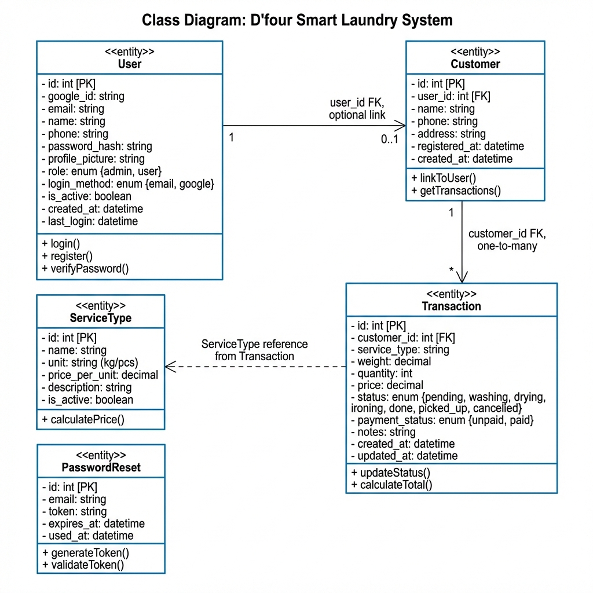
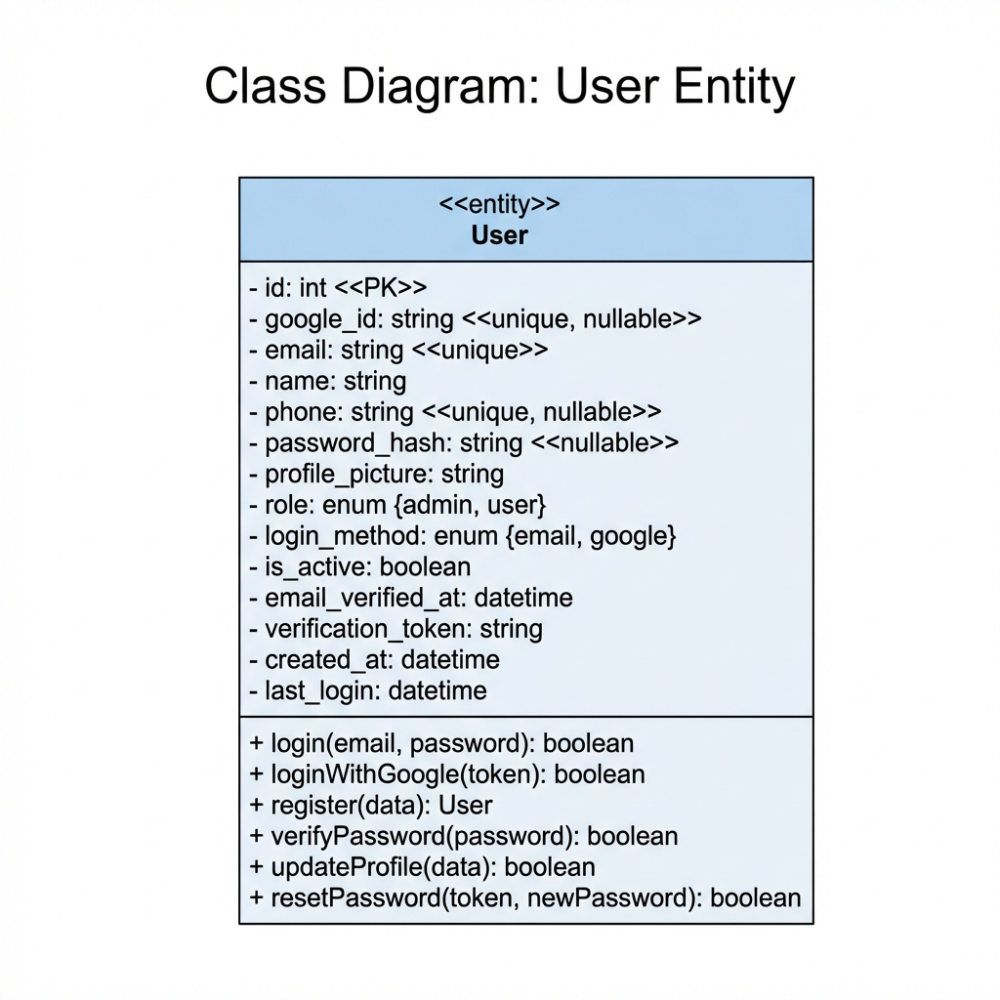
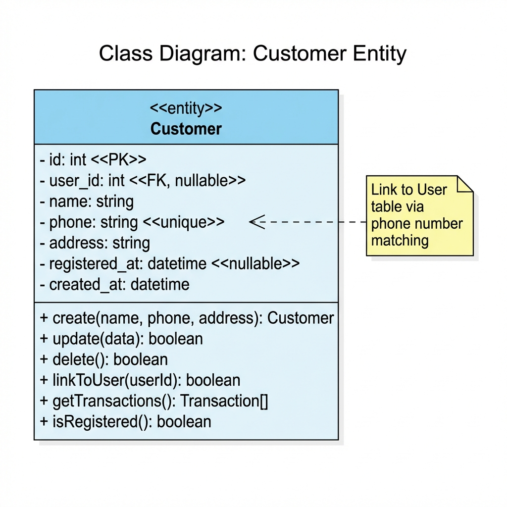
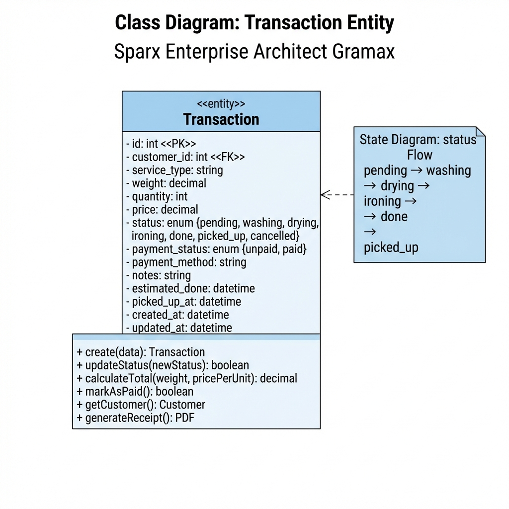
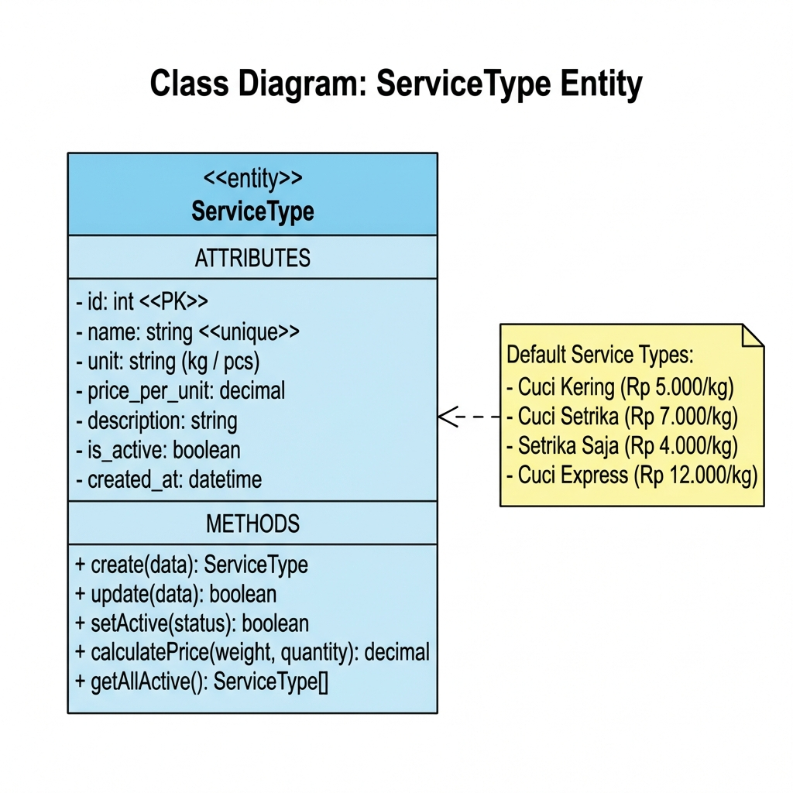
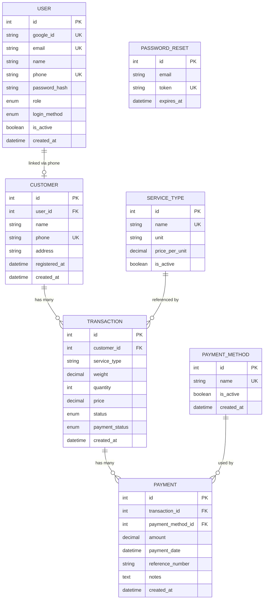

# 📊 Class Diagram - D'four Smart Laundry System

**Versi**: 1.1  
**Tanggal**: 2026-01-16  
**Status**: Berdasarkan database schema dan implementasi codebase

---

## 📋 Daftar Class/Entity

| # | Entity | Deskripsi | Status |
|---|--------|-----------|--------|
| 1 | User | Data user (Admin/Pelanggan) | ✅ |
| 2 | Customer | Data pelanggan laundry | ✅ |
| 3 | Transaction | Data transaksi laundry | ✅ |
| 4 | ServiceType | Jenis layanan dan harga | ✅ |
| 5 | PasswordReset | Token reset password | ✅ |
| 6 | **PaymentMethod** | Metode pembayaran | ✅ |
| 7 | **Payment** | Data pembayaran transaksi | ✅ |

---

## 📖 Keterangan Notasi UML

| Simbol | Deskripsi |
|--------|-----------|
| `-` (minus) | Private attribute |
| `+` (plus) | Public method |
| `<<PK>>` | Primary Key |
| `<<FK>>` | Foreign Key |
| `<<unique>>` | Unique constraint |
| `1..* ` | One-to-many relationship |
| `0..1` | Zero-to-one relationship |

---

## 1️⃣ Class Diagram: Sistem Lengkap



### Relasi Antar Entity:
- **User ←→ Customer**: Optional link via `user_id` (FK) dan matching `phone`
- **Customer → Transaction**: One-to-many via `customer_id` (FK)
- **ServiceType → Transaction**: Reference via `service_type` string

---

## 2️⃣ Class Diagram: User Entity



### Deskripsi:
Entity **User** menyimpan data pengguna sistem, baik Admin (Karyawan) maupun Pelanggan.

**Key Features:**
- Dual login: Email/Password + Google OAuth
- Role-based access: `admin` atau `user`
- Linked ke Customer via phone number

### Atribut:
| Nama | Tipe | Constraint | Deskripsi |
|------|------|------------|-----------|
| id | int | PK, Auto | ID unik |
| google_id | string | unique, null | ID Google OAuth |
| email | string | unique | Email login |
| name | string | - | Nama lengkap |
| phone | string | unique, null | Nomor HP |
| password_hash | string | null | Hash password (bcrypt) |
| role | enum | admin/user | Role pengguna |
| login_method | enum | email/google | Metode login |
| is_active | boolean | default true | Status aktif |

---

## 3️⃣ Class Diagram: Customer Entity



### Deskripsi:
Entity **Customer** menyimpan data pelanggan laundry yang dicatat oleh Karyawan.

**Key Features:**
- Auto-link ke User via phone number
- Track status registrasi via `registered_at`
- One-to-many ke Transaction

### Atribut:
| Nama | Tipe | Constraint | Deskripsi |
|------|------|------------|-----------|
| id | int | PK | ID unik |
| user_id | int | FK, null | Link ke users table |
| name | string | - | Nama pelanggan |
| phone | string | unique | Nomor HP |
| address | string | null | Alamat |
| registered_at | datetime | null | Waktu registrasi akun |
| created_at | datetime | - | Waktu dibuat |

---

## 4️⃣ Class Diagram: Transaction Entity



### Deskripsi:
Entity **Transaction** menyimpan data transaksi laundry.

**Key Features:**
- Status flow: pending → washing → drying → ironing → done → picked_up
- Track payment status
- Linked ke Customer

### Atribut:
| Nama | Tipe | Constraint | Deskripsi |
|------|------|------------|-----------|
| id | int | PK | ID unik |
| customer_id | int | FK | Link ke customers |
| service_type | string | - | Jenis layanan |
| weight | decimal | - | Berat (kg) |
| quantity | int | - | Jumlah item |
| price | decimal | - | Total harga |
| status | enum | - | Status transaksi |
| payment_status | enum | unpaid/paid | Status pembayaran |

### Status Flow:
```
pending → washing → drying → ironing → done → picked_up
                                          ↓
                                     cancelled
```

---

## 5️⃣ Class Diagram: ServiceType Entity



### Deskripsi:
Entity **ServiceType** menyimpan jenis layanan dan harga.

### Default Service Types:
| Nama | Satuan | Harga |
|------|--------|-------|
| Cuci Kering | kg | Rp 5.000 |
| Cuci Setrika | kg | Rp 7.000 |
| Setrika Saja | kg | Rp 4.000 |
| Cuci Express | kg | Rp 12.000 |
| Bed Cover Single | pcs | Rp 15.000 |
| Bed Cover Double | pcs | Rp 25.000 |
| Selimut | pcs | Rp 20.000 |
| Jas/Blazer | pcs | Rp 20.000 |

---

## 6️⃣ Class Diagram: PaymentMethod Entity

### Deskripsi:
Entity **PaymentMethod** menyimpan daftar metode pembayaran yang tersedia.

### Atribut:
| Nama | Tipe | Constraint | Deskripsi |
|------|------|------------|-----------|
| id | int | PK | ID unik |
| name | string | unique | Nama metode (Tunai, Transfer, Midtrans) |
| is_active | boolean | default true | Status aktif |
| created_at | datetime | - | Waktu dibuat |

### Metode Pembayaran Default:
| ID | Nama | Status |
|----|------|--------|
| 1 | Tunai | Aktif |
| 2 | Transfer Bank | Aktif |
| 3 | Midtrans | Aktif |
| 4 | QRIS | Aktif |

---

## 7️⃣ Class Diagram: Payment Entity

### Deskripsi:
Entity **Payment** menyimpan data pembayaran untuk setiap transaksi.

### Atribut:
| Nama | Tipe | Constraint | Deskripsi |
|------|------|------------|-----------|
| id | int | PK | ID unik |
| transaction_id | int | FK | Link ke transactions |
| payment_method_id | int | FK | Link ke payment_methods |
| amount | decimal | - | Jumlah pembayaran |
| payment_date | datetime | - | Tanggal pembayaran |
| reference_number | string | null | Nomor referensi (Midtrans order_id) |
| notes | text | null | Catatan pembayaran |
| created_at | datetime | - | Waktu dibuat |

### Alur Pembayaran:
```
Unpaid (Saat transaksi dibuat)
    ↓
Pending (Setelah inisiasi pembayaran)
    ↓
Paid (Setelah konfirmasi/callback Midtrans)
```

---

## 📐 ERD (Entity Relationship Diagram)



---

## 📝 Catatan

1. Gambar menggunakan format standar **Sparx Enterprise Architect**
2. Entity berdasarkan `database/schema_full.sql`
3. Methods berdasarkan implementasi di `api/*.php`

### Referensi File:

| Entity | File Database | File API |
|--------|--------------|----------|
| User | `database/schema_full.sql` | `includes/auth.php` |
| Customer | `database/schema_full.sql` | `api/customers-api.php` |
| Transaction | `database/schema_full.sql` | `api/transactions-api.php` |
| ServiceType | `database/schema_full.sql` | - |
| PasswordReset | `database/schema_full.sql` | `pages/auth/forgot-password.php` |

---

*Dokumen ini berdasarkan analisis codebase D'four Smart Laundry System*
