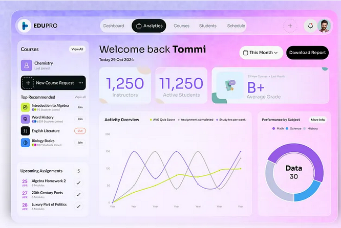
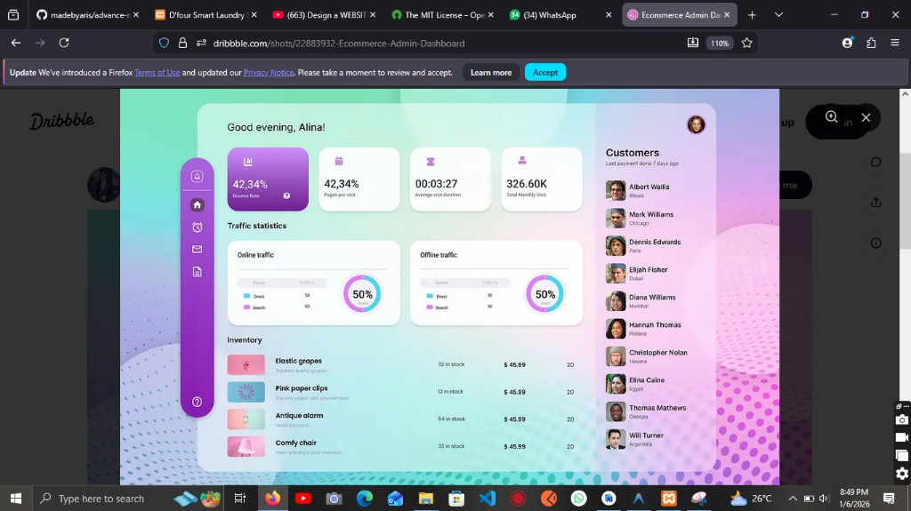

# 🎨 Design Inspiration - D'four Laundry Redesign

> **Dokumen ini berisi analisis mendalam dari 3 gambar inspirasi design untuk merombak tampilan web D'four Laundry.**

---

## 📸 Referensi Gambar

### Gambar 1: Dashboard User/Pelanggan


### Gambar 2: Login & Register Page


### Gambar 3: Admin Dashboard


---

## 🎯 Ciri Khas Utama Design

### 1. 🌈 Color Palette

#### User/Pelanggan Dashboard (Gambar 1)
| Elemen | Warna | Hex Code |
|--------|-------|----------|
| Background Gradient | Pink ke Purple | `#FFB6F3` → `#C8B6FF` |
| Accent Primary | Purple | `#7C3AED` |
| Secondary | Soft Pink | `#F9A8D4` |
| Cards | White + transparency | `rgba(255,255,255,0.8)` |
| Text Primary | Dark Purple | `#1E1B4B` |
| Text Secondary | Gray | `#6B7280` |
| Success Accent | Light Green | `#A3E635` |

#### Login/Register (Gambar 2)
| Elemen | Warna | Hex Code |
|--------|-------|----------|
| Background | Soft Gray | `#F8F9FB` |
| Card Background | White | `#FFFFFF` |
| Primary Button | Royal Blue | `#4F46E5` |
| Text Dark | Almost Black | `#1F2937` |
| Text Light | Gray | `#9CA3AF` |
| Border/Divider | Light Gray | `#E5E7EB` |

#### Admin Dashboard (Gambar 3)
| Elemen | Warna | Hex Code |
|--------|-------|----------|
| Sidebar Gradient | Pink ke Purple | `#EC4899` → `#8B5CF6` |
| Card Background | White | `#FFFFFF` |
| Accent/Stats | Purple/Pink | `#A855F7` / `#EC4899` |
| Text Primary | Dark | `#1F2937` |
| Background | Light Pink | `#FDF2F8` |

---

### 2. 📦 Glassmorphism Card Style

```css
.glass-card {
  background: rgba(255, 255, 255, 0.7);
  backdrop-filter: blur(10px);
  -webkit-backdrop-filter: blur(10px);
  border: 1px solid rgba(255, 255, 255, 0.3);
  border-radius: 24px;
  box-shadow: 0 8px 32px rgba(0, 0, 0, 0.1);
}
```

**Karakteristik:**
- Border Radius: 16px - 24px
- Shadow: Soft, tidak keras
- Padding: 20px - 32px
- Hover: Subtle lift + larger shadow

---

### 3. 🔤 Typography Scale

| Elemen | Weight | Size | Font |
|--------|--------|------|------|
| H1 (Welcome) | Bold 700 | 32-40px | Outfit |
| H2 (Section) | Semibold 600 | 20-24px | Outfit |
| H3 (Card Title) | Medium 500 | 16-18px | Outfit |
| Body | Regular 400 | 14-16px | Outfit |
| Caption | Regular 400 | 12-13px | Outfit |
| **Stats Number** | **Bold 700** | **36-48px** | Outfit |

---

### 4. 🎛️ Key UI Components

#### Primary Button (Gradient)
```css
.btn-primary {
  background: linear-gradient(135deg, #7C3AED, #EC4899);
  color: white;
  border-radius: 12px;
  padding: 12px 24px;
  font-weight: 600;
  transition: transform 0.2s, box-shadow 0.2s;
}

.btn-primary:hover {
  transform: translateY(-2px);
  box-shadow: 0 10px 25px rgba(124, 58, 237, 0.3);
}
```

#### Secondary Button (Login Style)
```css
.btn-secondary {
  background: #4F46E5;
  color: white;
  border-radius: 50px; /* pill shape */
  padding: 14px 32px;
  font-weight: 500;
}
```

#### Input Field (Underline Style)
```css
.input-underline {
  background: transparent;
  border: none;
  border-bottom: 2px solid #E5E7EB;
  padding: 12px 0;
  font-size: 16px;
}

.input-underline:focus {
  border-bottom-color: #4F46E5;
  outline: none;
}
```

#### Admin Sidebar
```css
.admin-sidebar {
  background: linear-gradient(180deg, #EC4899, #8B5CF6);
  border-radius: 0 32px 32px 0;
  padding: 24px 16px;
  width: 80px;
}

.sidebar-icon {
  background: rgba(255, 255, 255, 0.2);
  border-radius: 16px;
  padding: 14px;
  color: white;
}

.sidebar-icon.active {
  background: rgba(255, 255, 255, 0.4);
}
```

---

### 5. 📊 Charts & Data Visualization

- **Line Charts**: Smooth curves dengan gradient fill
- **Donut Charts**: Dengan center cutout, gradient strokes
- **Bar Charts**: Rounded corners (8px+)
- **Colors**: Use brand colors (purple, pink, green)

---

### 6. 🖼️ Decorative Elements

1. **Gradient Blobs** - Circular gradients di background
2. **Abstract Curves** - Soft shapes dengan low opacity
3. **Bubbles** - Laundry-themed bubble decorations
4. **Cards overlap** - Slight shadow untuk depth

---

### 7. 📱 Layout Patterns

#### User Dashboard
```
┌──────────────────────────────────────────────┐
│  Logo    [Tabs]              [Icons] Avatar  │
├──────────┬───────────────────────────────────┤
│ Sidebar  │  Welcome + Stats Row              │
│ (Courses)│  ┌─────────────────────────────┐  │
│          │  │  Charts + Activity          │  │
│          │  └─────────────────────────────┘  │
└──────────┴───────────────────────────────────┘
```

#### Login/Register
```
┌─────────────────────────────────────────────┐
│  ┌───────────────┬─────────────────────┐   │
│  │  SIGN IN      │   Hello Friend!     │   │
│  │  - Social     │   Start journey     │   │
│  │  - Form       │   [SIGN UP]         │   │
│  │  [SIGN IN]    │                     │   │
│  └───────────────┴─────────────────────┘   │
│          (Sliding panel animation)          │
└─────────────────────────────────────────────┘
```

#### Admin Dashboard
```
┌────┬──────────────────────────────┬─────────┐
│    │  Greeting + Stats            │Customers│
│ S  │  ┌────────────────────────┐  │ Panel   │
│ I  │  │  Traffic Statistics    │  │ (List)  │
│ D  │  └────────────────────────┘  │         │
│ E  │  ┌────────────────────────┐  │         │
│ B  │  │  Inventory List        │  │         │
│ A  │  └────────────────────────┘  │         │
│ R  │                              │         │
└────┴──────────────────────────────┴─────────┘
```

---

## 🛠️ Tech Stack untuk Implementasi

| Kategori | Tool |
|----------|------|
| CSS | Tailwind CSS + Custom CSS |
| Icons | Lucide Icons / Heroicons |
| Charts | Chart.js / ApexCharts |
| Fonts | Google Fonts (Outfit) |
| Animations | CSS Transitions + Keyframes |

---

## ✅ Implementation Priority

1. **Phase 1**: Setup Design System (colors, typography, variables)
2. **Phase 2**: Login & Register page redesign
3. **Phase 3**: User Dashboard redesign
4. **Phase 4**: Admin Dashboard redesign
5. **Phase 5**: Polish & animations

---

*Dokumen ini adalah panduan utama untuk redesign D'four Laundry*
