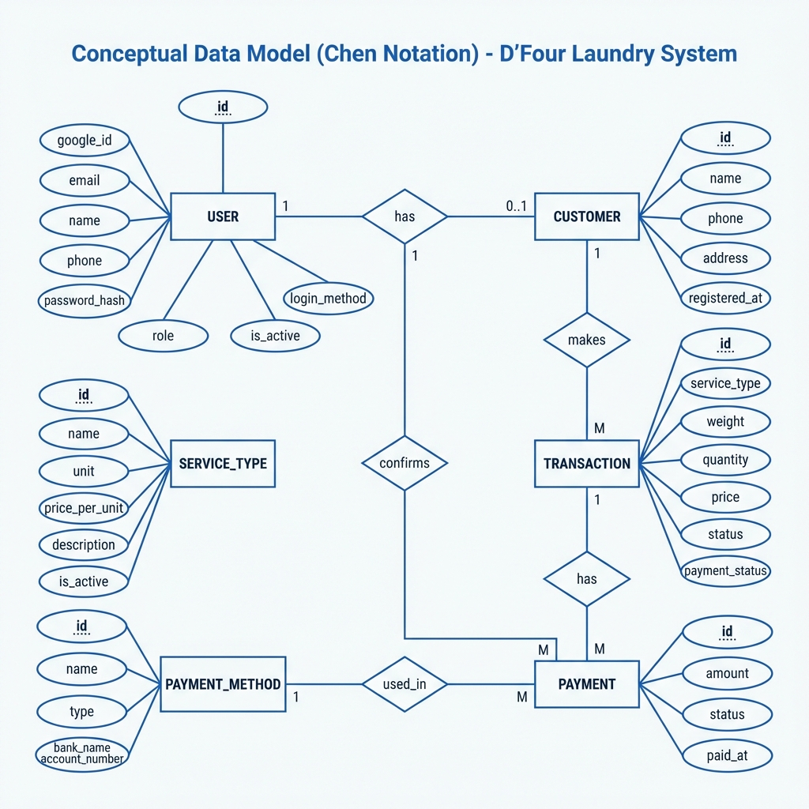
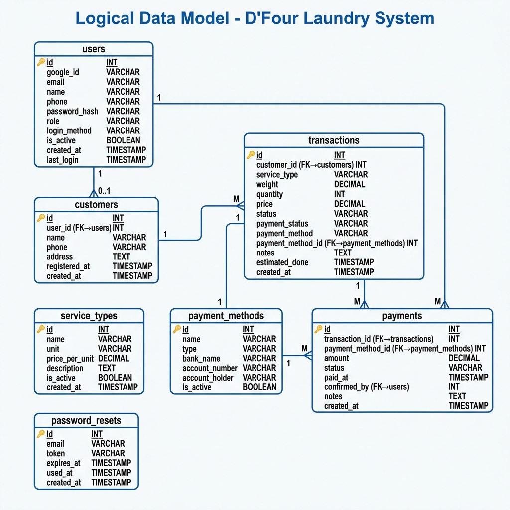
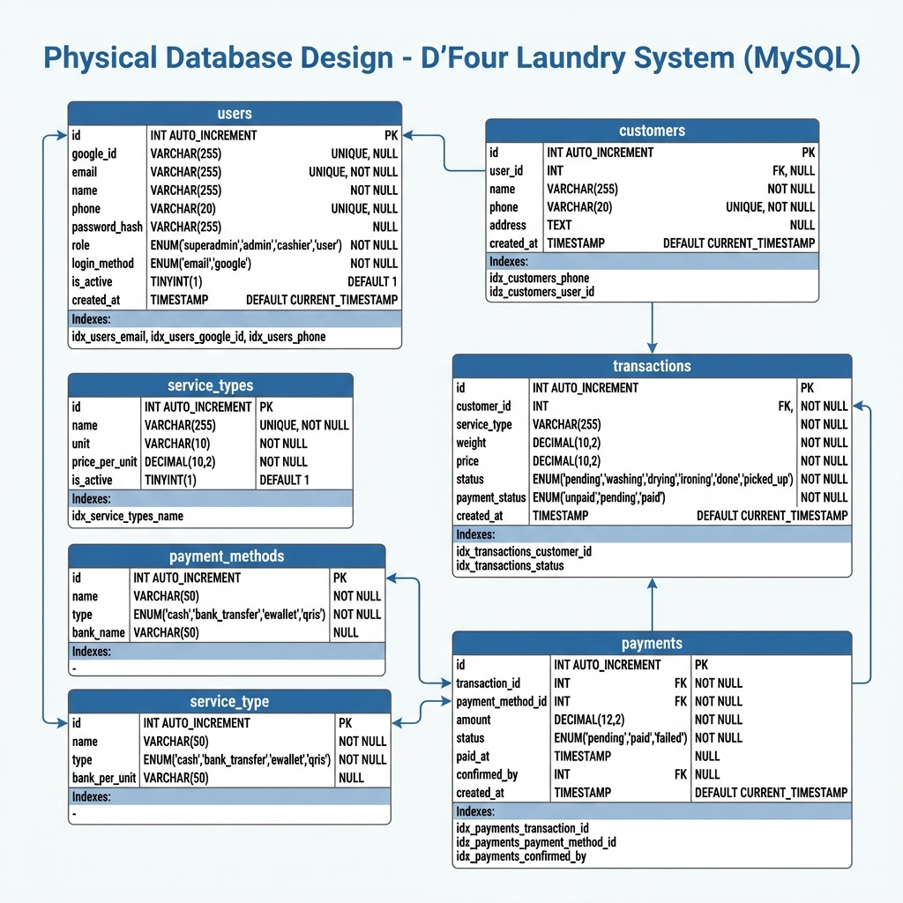
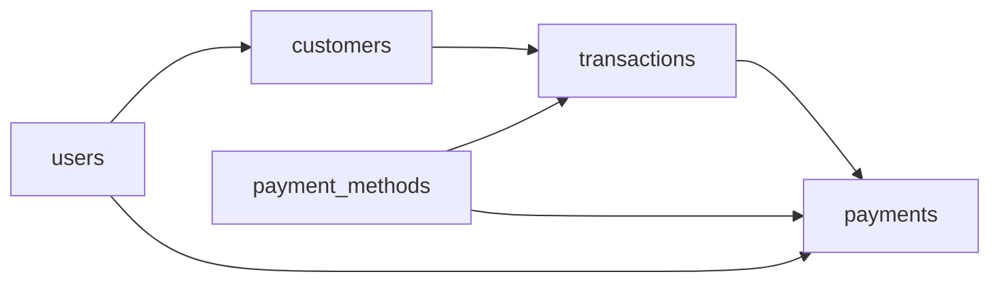

# 📊 ERD & Database Design - D'Four Smart Laundry System

**Versi**: 1.0  
**Tanggal**: 2026-01-17  
**Database**: MySQL 5.7+ / MariaDB 10.3+

---

## 📋 Daftar Diagram

| # | Diagram | Deskripsi | Gambar |
|---|---------|-----------|--------|
| 1 | Conceptual Design (Chen Notation) | ERD konseptual dengan notasi Chen | ✅ |
| 2 | Logical Design | Model data logis dengan Crow's Foot | ✅ |
| 3 | Physical Design | Desain fisik MySQL dengan tipe data | ✅ |

---

## 📖 Tingkatan Desain Database

| Level | Nama | Fokus | Output |
|-------|------|-------|--------|
| 1 | **Conceptual** | Entitas & Hubungan | ERD Chen |
| 2 | **Logical** | Atribut & Tipe Data | ERD Crow's Foot |
| 3 | **Physical** | Implementasi DBMS | DDL SQL |

---

## 1️⃣ Conceptual Design (ERD Chen Notation)



### Deskripsi

**Conceptual Data Model** adalah representasi tingkat tinggi dari struktur data yang berfokus pada:
- **Entity (Entitas)**: Objek utama dalam sistem
- **Relationship (Relasi)**: Hubungan antar entitas
- **Attributes (Atribut)**: Properti dari entitas

### Notasi Chen yang Digunakan

| Simbol | Nama | Keterangan |
|--------|------|------------|
| ▭ (Persegi) | Entity | Objek utama (tabel) |
| ◇ (Diamond) | Relationship | Hubungan antar entitas |
| ⬭ (Oval) | Attribute | Properti/kolom |
| ⬭̲ (Oval bergaris) | Primary Key | Atribut kunci utama |
| ⬭⬭ (Double Oval) | Multivalued | Atribut bernilai banyak |

### Daftar Entitas

| # | Entity | Deskripsi | Primary Key |
|---|--------|-----------|-------------|
| 1 | **USER** | Pengguna sistem (Admin/Pelanggan) | id |
| 2 | **CUSTOMER** | Data pelanggan laundry | id |
| 3 | **SERVICE_TYPE** | Jenis layanan laundry | id |
| 4 | **PAYMENT_METHOD** | Metode pembayaran | id |
| 5 | **TRANSACTION** | Transaksi laundry | id |
| 6 | **PAYMENT** | Pembayaran transaksi | id |

### Daftar Relasi & Kardinalitas

| Relasi | Entity 1 | Kardinalitas | Entity 2 | Deskripsi |
|--------|----------|--------------|----------|-----------|
| `has` | USER | 1 : 0..1 | CUSTOMER | User bisa memiliki 1 data customer |
| `makes` | CUSTOMER | 1 : M | TRANSACTION | Customer membuat banyak transaksi |
| `has` | TRANSACTION | 1 : M | PAYMENT | Transaksi memiliki banyak pembayaran |
| `used_in` | PAYMENT_METHOD | 1 : M | PAYMENT | Metode digunakan di banyak pembayaran |
| `confirms` | USER | 1 : M | PAYMENT | User mengkonfirmasi pembayaran |

---

## 2️⃣ Logical Design (Crow's Foot Notation)



### Deskripsi

**Logical Data Model** adalah representasi detail yang menunjukkan:
- Struktur tabel dengan atribut
- Primary Key (PK) dan Foreign Key (FK)
- Tipe data generic (INT, VARCHAR, TEXT, dll)
- Kardinalitas dengan notasi Crow's Foot

### Notasi Crow's Foot

| Simbol | Nama | Arti |
|--------|------|------|
| `──┤├──` | One to Many | 1 : M |
| `──○┤├──` | Zero or One to Many | 0..1 : M |
| `──┼──` | One to One | 1 : 1 |
| `──○──` | Zero or One | 0 : 1 |

### Struktur Tabel (Logical)

#### Tabel: `users`
| Kolom | Tipe | Constraint |
|-------|------|------------|
| id | INT | PK |
| google_id | VARCHAR | UNIQUE, NULL |
| email | VARCHAR | UNIQUE, NOT NULL |
| name | VARCHAR | NOT NULL |
| phone | VARCHAR | UNIQUE, NULL |
| password_hash | VARCHAR | NULL |
| role | VARCHAR | NOT NULL |
| login_method | VARCHAR | NOT NULL |
| is_active | BOOLEAN | DEFAULT TRUE |
| created_at | TIMESTAMP | |
| last_login | TIMESTAMP | NULL |

#### Tabel: `customers`
| Kolom | Tipe | Constraint |
|-------|------|------------|
| id | INT | PK |
| user_id | INT | FK → users, NULL |
| name | VARCHAR | NOT NULL |
| phone | VARCHAR | UNIQUE, NOT NULL |
| address | TEXT | NULL |
| registered_at | TIMESTAMP | NULL |
| created_at | TIMESTAMP | |

#### Tabel: `service_types`
| Kolom | Tipe | Constraint |
|-------|------|------------|
| id | INT | PK |
| name | VARCHAR | UNIQUE, NOT NULL |
| unit | VARCHAR | NOT NULL |
| price_per_unit | DECIMAL | NOT NULL |
| description | TEXT | NULL |
| is_active | BOOLEAN | DEFAULT TRUE |
| created_at | TIMESTAMP | |

#### Tabel: `payment_methods`
| Kolom | Tipe | Constraint |
|-------|------|------------|
| id | INT | PK |
| name | VARCHAR | NOT NULL |
| type | VARCHAR | NOT NULL |
| bank_name | VARCHAR | NULL |
| account_number | VARCHAR | NULL |
| account_holder | VARCHAR | NULL |
| is_active | BOOLEAN | DEFAULT TRUE |

#### Tabel: `transactions`
| Kolom | Tipe | Constraint |
|-------|------|------------|
| id | INT | PK |
| customer_id | INT | FK → customers, NOT NULL |
| service_type | VARCHAR | NOT NULL |
| weight | DECIMAL | |
| quantity | INT | |
| price | DECIMAL | NOT NULL |
| status | VARCHAR | NOT NULL |
| payment_status | VARCHAR | NOT NULL |
| payment_method | VARCHAR | NULL |
| payment_method_id | INT | FK → payment_methods |
| notes | TEXT | NULL |
| estimated_done | TIMESTAMP | NULL |
| created_at | TIMESTAMP | |

#### Tabel: `payments`
| Kolom | Tipe | Constraint |
|-------|------|------------|
| id | INT | PK |
| transaction_id | INT | FK → transactions, NOT NULL |
| payment_method_id | INT | FK → payment_methods, NOT NULL |
| amount | DECIMAL | NOT NULL |
| status | VARCHAR | NOT NULL |
| paid_at | TIMESTAMP | NULL |
| confirmed_by | INT | FK → users, NULL |
| notes | TEXT | NULL |
| created_at | TIMESTAMP | |

#### Tabel: `password_resets`
| Kolom | Tipe | Constraint |
|-------|------|------------|
| id | INT | PK |
| email | VARCHAR | NOT NULL |
| token | VARCHAR | UNIQUE, NOT NULL |
| expires_at | TIMESTAMP | NOT NULL |
| used_at | TIMESTAMP | NULL |
| created_at | TIMESTAMP | |

---

## 3️⃣ Physical Design (MySQL Implementation)



### Deskripsi

**Physical Data Model** adalah implementasi actual di MySQL dengan:
- Tipe data spesifik MySQL (INT, VARCHAR(n), DECIMAL(p,s), ENUM, dll)
- Constraint (PRIMARY KEY, FOREIGN KEY, UNIQUE, NOT NULL)
- Index untuk optimasi query
- Engine InnoDB untuk transaksi

### DDL (Data Definition Language)

#### Tabel: `users`
```sql
CREATE TABLE users (
    id INT AUTO_INCREMENT PRIMARY KEY,
    google_id VARCHAR(255) UNIQUE NULL,
    email VARCHAR(255) UNIQUE NOT NULL,
    name VARCHAR(255) NOT NULL,
    phone VARCHAR(20) UNIQUE NULL,
    password_hash VARCHAR(255) NULL,
    role ENUM('superadmin', 'admin', 'cashier', 'user') DEFAULT 'user',
    login_method ENUM('email', 'google') DEFAULT 'email',
    is_active TINYINT(1) DEFAULT 1,
    email_verified_at TIMESTAMP NULL,
    verification_token VARCHAR(64) NULL,
    verification_expires TIMESTAMP NULL,
    created_at TIMESTAMP DEFAULT CURRENT_TIMESTAMP,
    last_login TIMESTAMP NULL,
    
    INDEX idx_google_id (google_id),
    INDEX idx_email (email),
    INDEX idx_phone (phone),
    INDEX idx_role (role)
) ENGINE=InnoDB DEFAULT CHARSET=utf8mb4 COLLATE=utf8mb4_unicode_ci;
```

#### Tabel: `customers`
```sql
CREATE TABLE customers (
    id INT AUTO_INCREMENT PRIMARY KEY,
    user_id INT NULL,
    name VARCHAR(255) NOT NULL,
    phone VARCHAR(20) UNIQUE NOT NULL,
    address TEXT NULL,
    registered_at TIMESTAMP NULL,
    created_at TIMESTAMP DEFAULT CURRENT_TIMESTAMP,
    
    INDEX idx_phone (phone),
    INDEX idx_user_id (user_id),
    
    CONSTRAINT fk_customer_user FOREIGN KEY (user_id) 
        REFERENCES users(id) ON DELETE SET NULL
) ENGINE=InnoDB DEFAULT CHARSET=utf8mb4 COLLATE=utf8mb4_unicode_ci;
```

#### Tabel: `service_types`
```sql
CREATE TABLE service_types (
    id INT AUTO_INCREMENT PRIMARY KEY,
    name VARCHAR(255) NOT NULL UNIQUE,
    unit VARCHAR(10) NOT NULL,
    price_per_unit DECIMAL(10,2) NOT NULL,
    description TEXT NULL,
    is_active TINYINT(1) DEFAULT 1,
    created_at TIMESTAMP DEFAULT CURRENT_TIMESTAMP,
    
    INDEX idx_is_active (is_active)
) ENGINE=InnoDB DEFAULT CHARSET=utf8mb4 COLLATE=utf8mb4_unicode_ci;
```

#### Tabel: `payment_methods`
```sql
CREATE TABLE payment_methods (
    id INT AUTO_INCREMENT PRIMARY KEY,
    name VARCHAR(50) NOT NULL,
    type ENUM('cash', 'bank_transfer', 'ewallet', 'qris') NOT NULL,
    bank_name VARCHAR(50) NULL,
    account_number VARCHAR(30) NULL,
    account_holder VARCHAR(100) NULL,
    is_active TINYINT(1) DEFAULT 1,
    created_at TIMESTAMP DEFAULT CURRENT_TIMESTAMP,
    updated_at TIMESTAMP DEFAULT CURRENT_TIMESTAMP ON UPDATE CURRENT_TIMESTAMP,
    
    INDEX idx_type (type),
    INDEX idx_is_active (is_active)
) ENGINE=InnoDB DEFAULT CHARSET=utf8mb4 COLLATE=utf8mb4_unicode_ci;
```

#### Tabel: `transactions`
```sql
CREATE TABLE transactions (
    id INT AUTO_INCREMENT PRIMARY KEY,
    customer_id INT NOT NULL,
    service_type VARCHAR(255) NOT NULL,
    weight DECIMAL(10,2) DEFAULT 0,
    quantity INT DEFAULT 1,
    price DECIMAL(10,2) NOT NULL,
    status ENUM('pending', 'washing', 'drying', 'ironing', 'done', 'picked_up', 'cancelled') DEFAULT 'pending',
    payment_status ENUM('unpaid', 'pending', 'paid') DEFAULT 'unpaid',
    payment_method VARCHAR(50) NULL,
    payment_method_id INT NULL,
    notes TEXT NULL,
    estimated_done TIMESTAMP NULL,
    picked_up_at TIMESTAMP NULL,
    created_at TIMESTAMP DEFAULT CURRENT_TIMESTAMP,
    updated_at TIMESTAMP DEFAULT CURRENT_TIMESTAMP ON UPDATE CURRENT_TIMESTAMP,
    
    INDEX idx_customer_id (customer_id),
    INDEX idx_status (status),
    INDEX idx_payment_status (payment_status),
    INDEX idx_created_at (created_at),
    
    CONSTRAINT fk_transaction_customer FOREIGN KEY (customer_id) 
        REFERENCES customers(id) ON DELETE CASCADE,
    CONSTRAINT fk_transaction_payment_method FOREIGN KEY (payment_method_id)
        REFERENCES payment_methods(id) ON DELETE SET NULL
) ENGINE=InnoDB DEFAULT CHARSET=utf8mb4 COLLATE=utf8mb4_unicode_ci;
```

#### Tabel: `payments`
```sql
CREATE TABLE payments (
    id INT AUTO_INCREMENT PRIMARY KEY,
    transaction_id INT NOT NULL,
    payment_method_id INT NOT NULL,
    amount DECIMAL(12,2) NOT NULL,
    status ENUM('unpaid', 'pending', 'paid', 'cancelled') DEFAULT 'unpaid',
    paid_at TIMESTAMP NULL,
    confirmed_by INT NULL,
    notes TEXT NULL,
    created_at TIMESTAMP DEFAULT CURRENT_TIMESTAMP,
    updated_at TIMESTAMP DEFAULT CURRENT_TIMESTAMP ON UPDATE CURRENT_TIMESTAMP,
    
    INDEX idx_transaction_id (transaction_id),
    INDEX idx_payment_method_id (payment_method_id),
    INDEX idx_status (status),
    
    CONSTRAINT fk_payment_transaction FOREIGN KEY (transaction_id)
        REFERENCES transactions(id) ON DELETE CASCADE,
    CONSTRAINT fk_payment_method FOREIGN KEY (payment_method_id)
        REFERENCES payment_methods(id) ON DELETE RESTRICT,
    CONSTRAINT fk_payment_confirmed_by FOREIGN KEY (confirmed_by)
        REFERENCES users(id) ON DELETE SET NULL
) ENGINE=InnoDB DEFAULT CHARSET=utf8mb4 COLLATE=utf8mb4_unicode_ci;
```

#### Tabel: `password_resets`
```sql
CREATE TABLE password_resets (
    id INT AUTO_INCREMENT PRIMARY KEY,
    email VARCHAR(255) NOT NULL,
    token VARCHAR(64) NOT NULL UNIQUE,
    expires_at TIMESTAMP NOT NULL,
    used_at TIMESTAMP NULL,
    created_at TIMESTAMP DEFAULT CURRENT_TIMESTAMP,
    
    INDEX idx_token (token),
    INDEX idx_email (email)
) ENGINE=InnoDB DEFAULT CHARSET=utf8mb4 COLLATE=utf8mb4_unicode_ci;
```

---

## 📊 Ringkasan Struktur Database

### Statistik Tabel

| Tabel | Kolom | PK | FK | Index | Engine |
|-------|-------|----|----|-------|--------|
| users | 14 | 1 | 0 | 5 | InnoDB |
| customers | 6 | 1 | 1 | 2 | InnoDB |
| service_types | 7 | 1 | 0 | 1 | InnoDB |
| payment_methods | 8 | 1 | 0 | 2 | InnoDB |
| transactions | 14 | 1 | 2 | 4 | InnoDB |
| payments | 10 | 1 | 3 | 3 | InnoDB |
| password_resets | 6 | 1 | 0 | 2 | InnoDB |
| **Total** | **65** | **7** | **6** | **19** | - |

### Relasi Foreign Key



---

## 📚 Referensi

1. **Peter Chen** (1976). *The Entity-Relationship Model—Toward a Unified View of Data*. ACM Transactions on Database Systems.

2. **Elmasri & Navathe** (2015). *Fundamentals of Database Systems* (7th Edition). Pearson.

3. **MySQL 8.0 Reference Manual**. https://dev.mysql.com/doc/refman/8.0/en/

---

## 🔗 File Terkait

| File | Deskripsi |
|------|-----------|
| [database/schema_full.sql](../database/schema_full.sql) | DDL lengkap semua tabel |
| [class-diagram.md](class-diagram.md) | Class Diagram (UML) |
| [docs/er_diagram.png](er_diagram.png) | ERD original |

---

*Dokumen ini berdasarkan analisis schema database D'Four Smart Laundry System*
