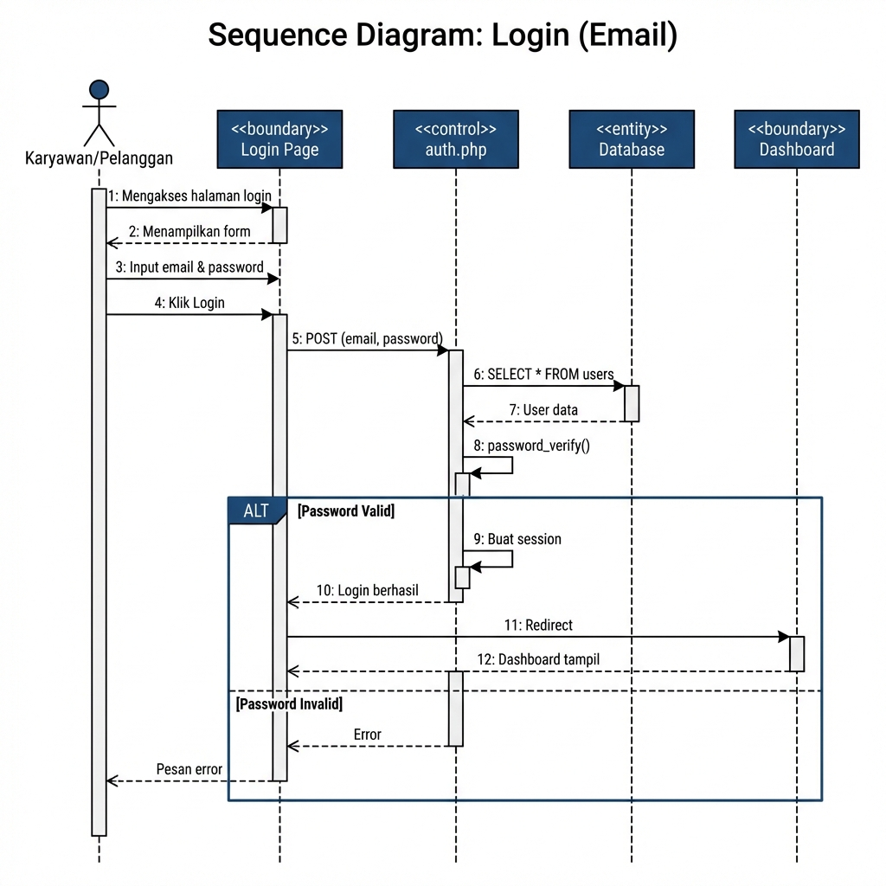
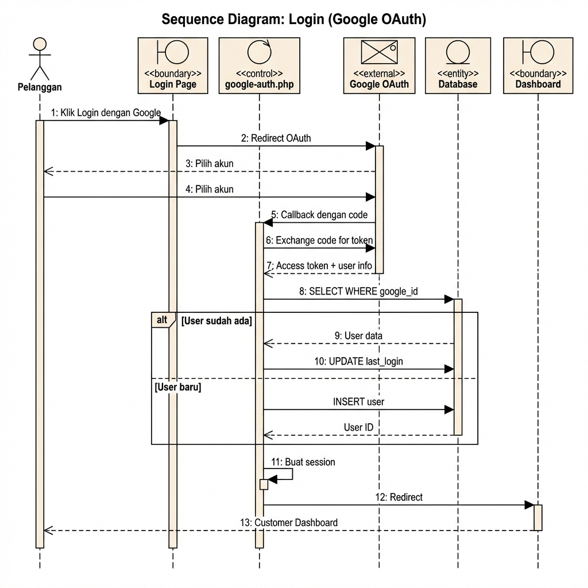
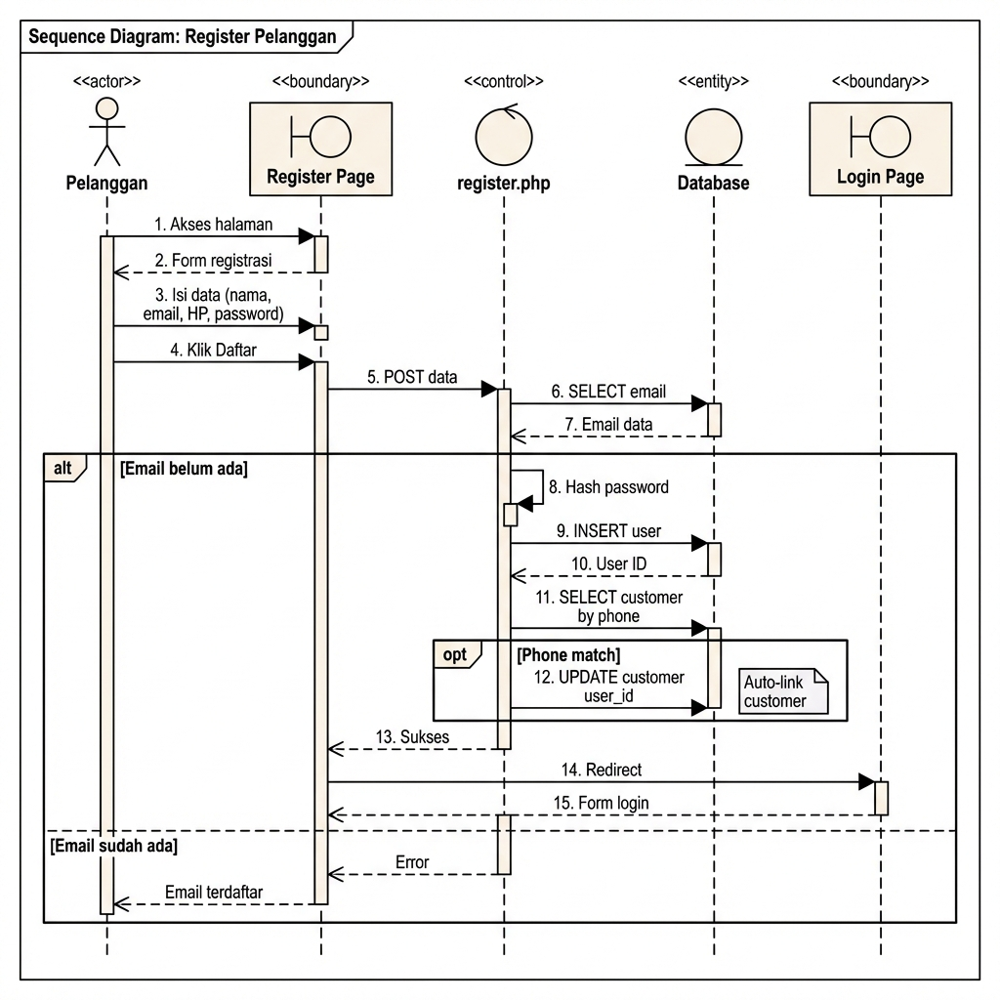
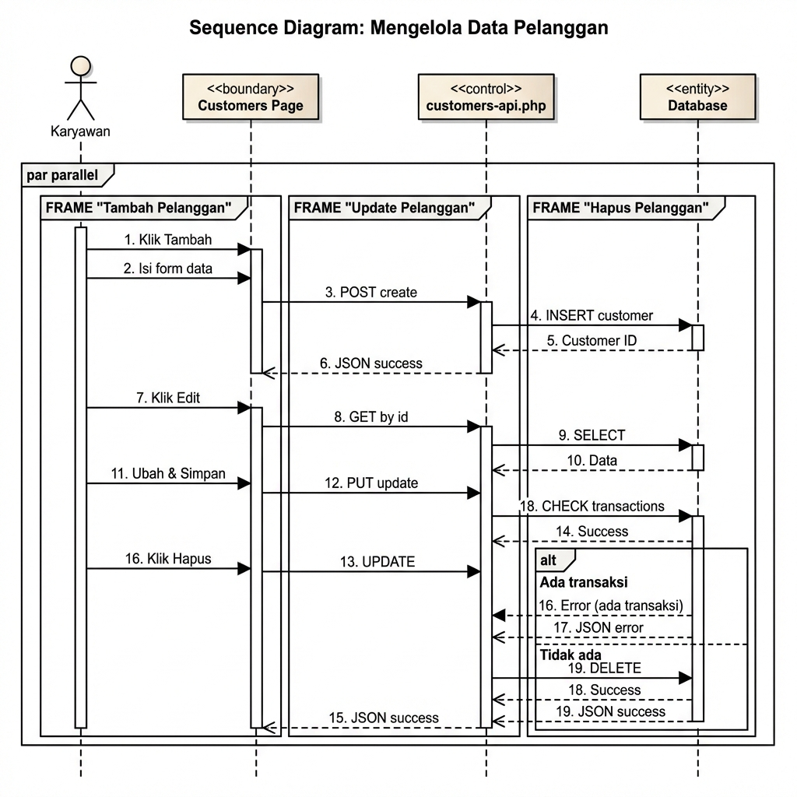
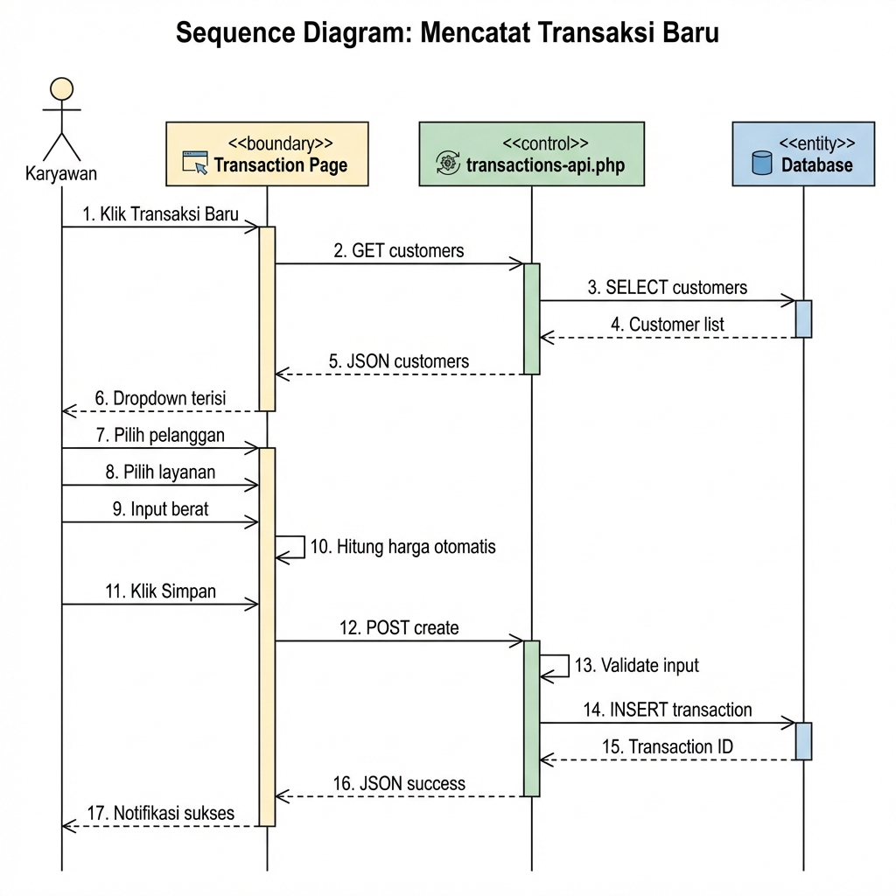
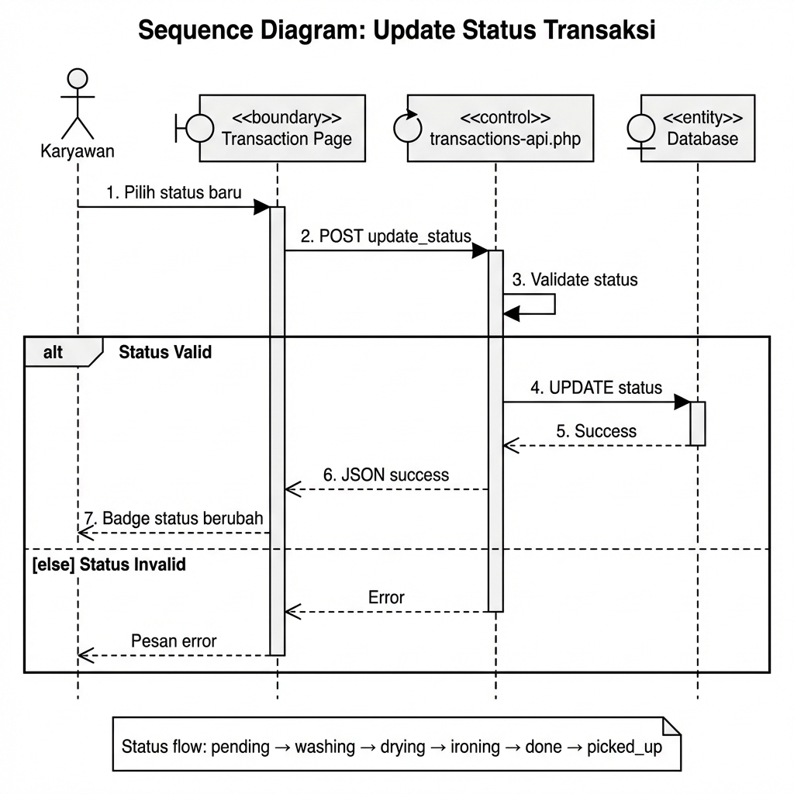
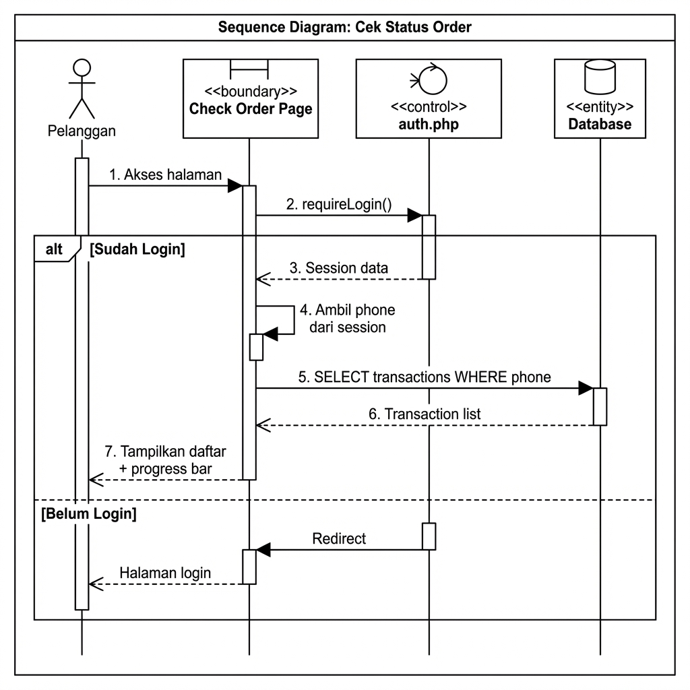
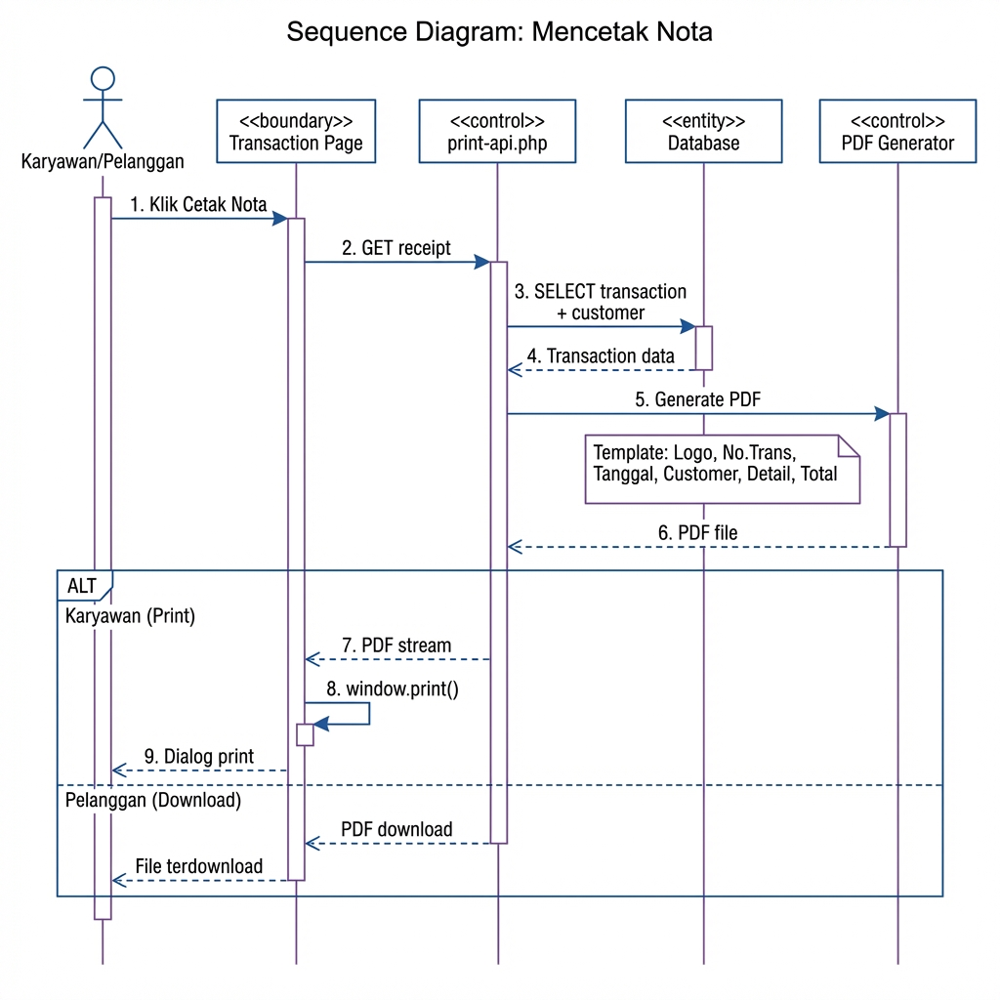
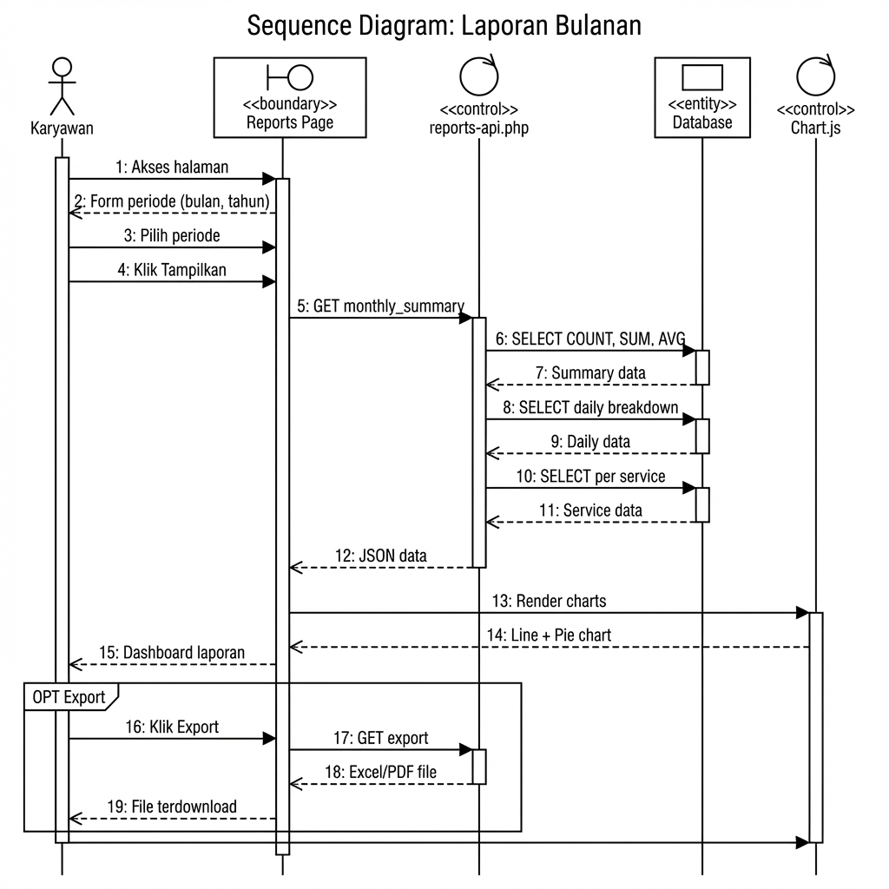

# 📊 Sequence Diagram - D'four Smart Laundry System

**Versi**: 1.2  
**Tanggal**: 2026-01-11  
**Status**: Berdasarkan fitur yang sudah ada dan sedang dikembangkan

---

## 📋 Daftar Sequence Diagram

| # | Diagram | Status | Gambar |
|---|---------|--------|--------|
| 1 | Login (Email) | ✅ Implemented | ✅ |
| 2 | Login (Google OAuth) | ✅ Implemented | ✅ |
| 3 | Register Pelanggan | ✅ Implemented | ✅ |
| 4 | Mengelola Data Pelanggan | ✅ Implemented | ✅ |
| 5 | Mencatat Transaksi Baru | ✅ Implemented | ✅ |
| 6 | Update Status Transaksi | ✅ Implemented | ✅ |
| 7 | Cek Status Order (Pelanggan) | ✅ Implemented | ✅ |
| 8 | Mencetak Nota | 🚧 TODO | ✅ |
| 9 | Laporan Bulanan | 🚧 TODO | ✅ |

---

## 📖 Keterangan Jenis Boundary (Stereotype)

| Stereotype | Simbol | Deskripsi | Contoh |
|------------|--------|-----------|--------|
| **<<boundary>>** | 🖥️ | Komponen antarmuka pengguna (UI) | Login Page, Dashboard |
| **<<control>>** | ⚙️ | Komponen logika bisnis / controller | auth.php, customers-api.php |
| **<<entity>>** | 📦 | Komponen penyimpanan data | Database, Session |
| **<<external>>** | 🌐 | Sistem eksternal | Google OAuth, Email Service |

---

## 1️⃣ Sequence Diagram: Login (Email)



### Deskripsi Alur:
1. User mengakses halaman login
2. Input email dan password, klik Login
3. Sistem validasi dengan database
4. Jika valid: buat session, redirect ke dashboard
5. Jika invalid: tampilkan pesan error

---

## 2️⃣ Sequence Diagram: Login (Google OAuth)



### Deskripsi Alur:
1. User klik "Login dengan Google"
2. Redirect ke Google OAuth
3. User pilih akun Google
4. Google callback dengan auth code
5. Sistem exchange code untuk token
6. Cek user di database, insert jika baru
7. Buat session, redirect ke dashboard

---

## 3️⃣ Sequence Diagram: Register Pelanggan



### Deskripsi Alur:
1. Pelanggan akses halaman register
2. Isi form (nama, email, HP, password)
3. Sistem validasi dan cek email exists
4. Jika email baru: hash password, simpan user
5. Auto-link customer jika phone match
6. Redirect ke halaman login

---

## 4️⃣ Sequence Diagram: Mengelola Data Pelanggan (CRUD)



### Deskripsi Alur:
**Tambah:** Klik tambah → isi form → POST create → INSERT database
**Update:** Klik edit → GET data → ubah → PUT update → UPDATE database
**Hapus:** Klik hapus → cek transaksi → jika tidak ada → DELETE

---

## 5️⃣ Sequence Diagram: Mencatat Transaksi Baru



### Deskripsi Alur:
1. Karyawan klik "Transaksi Baru"
2. Sistem load daftar pelanggan dan layanan
3. Karyawan pilih pelanggan, layanan, input berat
4. Sistem hitung harga otomatis
5. Karyawan simpan transaksi
6. Sistem INSERT dengan status pending

---

## 6️⃣ Sequence Diagram: Update Status Transaksi



### Deskripsi Alur:
1. Karyawan pilih status baru dari dropdown
2. Sistem validasi status
3. Jika valid: UPDATE database, tampilkan badge baru
4. Jika invalid: tampilkan error

### Alur Status Valid:
```
pending → washing → drying → ironing → done → picked_up
```

---

## 7️⃣ Sequence Diagram: Cek Status Order (Pelanggan)



### Deskripsi Alur:
1. Pelanggan akses halaman cek status
2. Sistem cek login, redirect jika belum
3. Ambil phone dari session
4. Query transaksi berdasarkan phone
5. Tampilkan daftar dengan progress bar

---

## 8️⃣ Sequence Diagram: Mencetak Nota (TODO)



### Deskripsi Alur:
1. User klik "Cetak Nota" pada transaksi
2. Sistem ambil data transaksi dan pelanggan
3. Generate PDF dengan template nota
4. Karyawan: buka dialog print
5. Pelanggan: download file PDF

---

## 9️⃣ Sequence Diagram: Laporan Bulanan (TODO)



### Deskripsi Alur:
1. Karyawan akses halaman laporan
2. Pilih periode (bulan, tahun)
3. Sistem query data summary, daily, per service
4. Render charts (Line, Pie, Bar)
5. Tampilkan dashboard laporan
6. Optional: export ke Excel/PDF

---

## 📝 Catatan

1. **Implemented (✅)**: Fitur sudah ada di codebase
2. **TODO (🚧)**: Fitur dalam tahap pengembangan
3. Gambar menggunakan format standar **Sparx Enterprise Architect**

### Referensi File:

| Sequence | File Terkait |
|----------|--------------|
| Login | `pages/auth/login.php`, `includes/auth.php` |
| Register | `pages/auth/register.php` |
| Kelola Pelanggan | `pages/customers.php`, `api/customers-api.php` |
| Transaksi | `pages/transactions.php`, `api/transactions-api.php` |
| Cek Status | `pages/check-order.php` |
| Cetak Nota | `pages/print-receipt.php` (TODO) |
| Laporan | `pages/reports.php` (TODO) |

---

*Dokumen ini berdasarkan analisis codebase D'four Smart Laundry System*
