# 📊 Use Case Diagram - D'four Smart Laundry System

**Versi**: 1.1  
**Tanggal**: 2026-01-08  
**Status**: Sesuai dengan fitur yang ada dan yang sedang dikembangkan

---

## 🎭 Aktor Sistem

| Aktor | Deskripsi | Role di Database |
|-------|-----------|------------------|
| **Karyawan (Admin)** | Operasional harian, transaksi, pelanggan, laporan | `admin` |
| **Pelanggan** | Customer yang menggunakan layanan laundry | `user` |

---

## 📐 Use Case Diagram Utama

```mermaid
flowchart TB
    subgraph Actors
        AD["👨‍💼 Karyawan/Admin"]
        PL["👤 Pelanggan"]
    end

    subgraph Authentication["🔑 Authentication"]
        UC_LOGIN["Login"]
        UC_REGISTER["Register"]
        UC_LOGOUT["Logout"]
    end

    subgraph CustomerManagement["👥 Kelola Pelanggan"]
        UC_KELOLA_PELANGGAN["Mengelola Data Pelanggan"]
        UC_INPUT_PELANGGAN["Input Data Pelanggan"]
        UC_UPDATE_PELANGGAN["Update Data Pelanggan"]
        UC_CARI_PELANGGAN["Mencari Data Pelanggan"]
        UC_HAPUS_PELANGGAN["Menghapus Data Pelanggan"]
        UC_INVITE["Undang Pelanggan Daftar"]
    end

    subgraph TransactionManagement["💳 Kelola Transaksi"]
        UC_KELOLA_TRANSAKSI["Mengelola Data Transaksi"]
        UC_INPUT_TRANSAKSI["Input Transaksi Baru"]
        UC_UPDATE_STATUS["Mengubah Status Order"]
        UC_HAPUS_TRANSAKSI["Menghapus Transaksi"]
        UC_LIHAT_TRANSAKSI["Melihat Detail Transaksi"]
    end

    subgraph CustomerPortal["📱 Portal Pelanggan"]
        UC_CEK_STATUS["Cek Status Order"]
        UC_RIWAYAT["Melihat Riwayat Transaksi"]
        UC_DASHBOARD_CUSTOMER["Customer Dashboard"]
    end

    subgraph Reports["📊 Laporan (TODO)"]
        UC_LAPORAN_BULANAN["Mengelola Laporan Bulanan"]
        UC_EXPORT_REPORT["Export Laporan"]
    end

    subgraph Notifications["🔔 Notifikasi (TODO)"]
        UC_NOTIF_WAKTU["Notifikasi Waktu Pengerjaan"]
        UC_NOTIF_SELESAI["Notifikasi Order Selesai"]
    end

    subgraph PrintSystem["🖨️ Cetak (TODO)"]
        UC_UNDUH_NOTA["Mengunduh/Cetak Nota"]
    end

    %% Karyawan/Admin connections
    AD --> UC_LOGIN
    AD --> UC_LOGOUT
    AD --> UC_KELOLA_PELANGGAN
    AD --> UC_KELOLA_TRANSAKSI
    AD --> UC_UNDUH_NOTA
    AD --> UC_LAPORAN_BULANAN
    AD --> UC_NOTIF_WAKTU

    %% Pelanggan connections
    PL --> UC_LOGIN
    PL --> UC_REGISTER
    PL --> UC_LOGOUT
    PL --> UC_CEK_STATUS
    PL --> UC_RIWAYAT
    PL --> UC_DASHBOARD_CUSTOMER

    %% Include relationships
    UC_KELOLA_PELANGGAN -.->|include| UC_INPUT_PELANGGAN
    UC_KELOLA_PELANGGAN -.->|include| UC_UPDATE_PELANGGAN
    UC_KELOLA_PELANGGAN -.->|include| UC_CARI_PELANGGAN
    UC_KELOLA_PELANGGAN -.->|include| UC_HAPUS_PELANGGAN
    UC_KELOLA_PELANGGAN -.->|include| UC_INVITE

    UC_KELOLA_TRANSAKSI -.->|include| UC_INPUT_TRANSAKSI
    UC_KELOLA_TRANSAKSI -.->|include| UC_UPDATE_STATUS
    UC_KELOLA_TRANSAKSI -.->|include| UC_HAPUS_TRANSAKSI
    UC_KELOLA_TRANSAKSI -.->|include| UC_LIHAT_TRANSAKSI

    UC_LAPORAN_BULANAN -.->|extend| UC_EXPORT_REPORT

    UC_NOTIF_WAKTU -.->|extend| UC_NOTIF_SELESAI
```



---

## ✅ Status Implementasi Use Case

### Fitur yang Sudah Ada (Implemented)

| Use Case | File Utama | API Endpoint | Status |
|----------|-----------|--------------|--------|
| Login | `pages/auth/login.php` | `api/auth/*` | ✅ |
| Register | `pages/auth/register.php` | `api/auth/register.php` | ✅ |
| Logout | `api/logout.php` | - | ✅ |
| Input Data Pelanggan | `pages/customers.php` | `api/customers-api.php?action=create` | ✅ |
| Update Data Pelanggan | `pages/customers.php` | `api/customers-api.php?action=update` | ✅ |
| Mencari Data Pelanggan | `pages/customers.php` | `api/customers-api.php?action=get_by_phone` | ✅ |
| Menghapus Data Pelanggan | `pages/customers.php` | `api/customers-api.php?action=delete` | ✅ |
| Undang Pelanggan | `pages/customers.php` | Customer-User Integration | ✅ |
| Input Transaksi Baru | `pages/transactions.php` | `api/transactions-api.php?action=create` | ✅ |
| Mengubah Status Order | `pages/transactions.php` | `api/transactions-api.php?action=update_status` | ✅ |
| Menghapus Transaksi | `pages/transactions.php` | `api/transactions-api.php?action=delete` | ✅ |
| Melihat Detail Transaksi | `pages/transactions.php` | `api/transactions-api.php?action=get_by_id` | ✅ |
| Cek Status Order | `pages/check-order.php` | - | ✅ |
| Customer Dashboard | `pages/customer-dashboard.php` | - | ✅ |

### Fitur dalam Pengembangan (TODO)

| Use Case | Rencana File | Prioritas | Referensi |
|----------|-------------|-----------|-----------|
| Mengunduh/Cetak Nota | `pages/print-receipt.php` | 🔴 High | to-do.md Line 158-160 |
| Laporan Bulanan | `pages/reports.php` | 🟡 Medium | to-do.md Line 197-239 |
| Export Laporan | `api/reports-api.php` | 🟡 Medium | to-do.md Line 231-234 |
| Notifikasi Waktu Pengerjaan | Email/WhatsApp | 🟡 Medium | to-do.md Line 241-248 |

---

## 🔄 Alur Status Transaksi


---

## 📋 Daftar Use Case Detail

### UC-01: Login
- **Aktor**: Semua
- **Deskripsi**: Masuk ke sistem dengan email/password atau Google OAuth
- **Precondition**: User sudah terdaftar
- **Postcondition**: Session aktif, redirect ke dashboard sesuai role

### UC-02: Register
- **Aktor**: Pelanggan
- **Deskripsi**: Mendaftar akun baru dengan email, password, dan nomor HP
- **Precondition**: Email dan nomor HP belum terdaftar
- **Postcondition**: Akun dibuat, auto-link ke data customer jika phone match

### UC-03: Mengelola Data Pelanggan
- **Aktor**: Admin/Karyawan
- **Deskripsi**: CRUD operasi untuk data pelanggan
- **Include**: Input, Update, Cari, Hapus Data Pelanggan

### UC-04: Mengelola Data Transaksi
- **Aktor**: Admin/Karyawan
- **Deskripsi**: CRUD operasi untuk transaksi laundry
- **Include**: Input, Update Status, Hapus Transaksi

### UC-05: Cek Status Order
- **Aktor**: Pelanggan
- **Deskripsi**: Melihat status cucian berdasarkan nomor telepon
- **Precondition**: Customer sudah login
- **Postcondition**: Menampilkan daftar transaksi dan statusnya

### UC-06: Laporan Bulanan (TODO)
- **Aktor**: Admin, Superadmin
- **Deskripsi**: Generate dan lihat laporan transaksi per bulan
- **Extend**: Export ke Excel/PDF

### UC-07: Mengunduh Nota (TODO)
- **Aktor**: Admin/Karyawan
- **Deskripsi**: Cetak/download nota transaksi
- **Format**: PDF, thermal printer friendly

---

## 📝 Catatan Revisi

| Versi | Tanggal | Perubahan |
|-------|---------|-----------|
| 1.0 | 2026-01-08 | Dokumen awal berdasarkan analisis codebase |
| 1.1 | 2026-01-08 | Menghapus aktor Superadmin |
| 1.2 | 2026-01-09 | Menambahkan analisis kesalahan berdasarkan standar internasional |
| 1.3 | 2026-01-09 | Update analisis kesalahan berdasarkan diagram terbaru di EA |

---

## ⚠️ Analisis Kesalahan Use Case Diagram (Versi Terbaru)

Berdasarkan diagram yang dibuat di **Enterprise Architect**, berikut adalah analisis kesalahan dan solusinya:

### ✅ Yang Sudah Benar pada Diagram:
- ✅ Ada **System Boundary** "Sistem Laundry"
- ✅ Aktor **Karyawan** dan **Pelanggan** sudah dipisah dengan benar
- ✅ Login menggunakan **<<include>>** dari Register (benar)
- ✅ Aktor diletakkan di luar system boundary

### 📚 Referensi Standar yang Digunakan

| Sumber | Deskripsi | Tahun |
|--------|-----------|-------|
| **OMG UML 2.5.1** | Object Management Group - Unified Modeling Language Specification | 2017 |
| **Ivar Jacobson** | "Object-Oriented Software Engineering: A Use Case Driven Approach" | 1992 |
| **Alistair Cockburn** | "Writing Effective Use Cases" | 2001 |
| **Craig Larman** | "Applying UML and Patterns" | 2004 |

---

### 🔴 Kesalahan #1: Arah Panah <<extend>> Terbalik

**Kesalahan:**
Pada diagram:
```
Mengelola Data Pelanggan --<<extend>>--> Mencari Data Pelanggan
Mengelola Data Pelanggan --<<extend>>--> Input Data Pelanggan
Mengelola Data Pelanggan --<<extend>>--> Menghapus Data Pelanggan
```

**Standar yang Dilanggar:**
> *"The arrow for an extend relationship points from the extending use case to the extended (base) use case."*
> — **OMG UML 2.5.1, Section 18.1.4**

**Penjelasan:**
- Panah <<extend>> harus **DARI use case opsional KE use case utama (base)**
- Bukan sebaliknya

**Perbaikan:**
```
Mencari Data Pelanggan --<<extend>>--> Mengelola Data Pelanggan
Input Data Pelanggan --<<extend>>--> Mengelola Data Pelanggan
```
Artinya: "Mencari Data" adalah fitur opsional yang meng-extend "Mengelola Data".

---

### 🔴 Kesalahan #2: Functional Decomposition (CRUD dipisah)

**Kesalahan:**
CRUD operations dipisah menjadi use case terpisah:
- Input Data Pelanggan
- Update Data Pelanggan
- Menghapus Data Pelanggan
- Mencari Data Pelanggan

**Standar yang Dilanggar:**
> *"Don't split a use case into CRUD operations. Create, Read, Update, Delete are not separate user goals."*
> — **Alistair Cockburn, Writing Effective Use Cases, p.87**

> *"A use case should describe a complete scenario that delivers value to the actor, not a single database operation."*
> — **Craig Larman, Applying UML and Patterns, p.69**

**Perbaikan:**
Gunakan **satu use case** "**Mengelola Data Pelanggan**" saja. Detail CRUD dijelaskan dalam **Use Case Description/Skenario**, bukan di diagram.

---

### 🔴 Kesalahan #3: Use Case Extend ke Dua Base Use Case

**Kesalahan:**
Pada diagram, "menghapus transaksi" memiliki **2 relasi extend**:
1. ke "Mengelola Data Transaksi"
2. ke "menghapus data transaksi"

**Standar yang Dilanggar:**
> *"An extend relationship relates a single extending use case to a single extended use case."*
> — **OMG UML 2.5.1, Section 18.1.4.3**

**Perbaikan:**
Satu use case extend hanya boleh meng-extend **satu base use case**. Hapus salah satu relasi.

---

### 🔴 Kesalahan #4: Duplikasi Use Case

**Kesalahan:**
Ada use case yang mirip/duplikat:
- "menghapus transaksi" dan "menghapus data transaksi" (fungsi sama)
- "Mengupdate data transaksi" (sudah tercakup dalam Mengelola Data Transaksi)

**Standar yang Dilanggar:**
> *"Each use case should represent a unique, discrete goal. Avoid redundant use cases."*
> — **Ivar Jacobson, OOSE, p.155**

**Perbaikan:**
Hapus use case yang duplikat. Pilih satu nama yang konsisten.

| Hapus ❌ | Pertahankan ✅ |
|---------|---------------|
| menghapus transaksi | (gabung ke Mengelola Data Transaksi) |
| menghapus data transaksi | (gabung ke Mengelola Data Transaksi) |
| Mengupdate data transaksi | (gabung ke Mengelola Data Transaksi) |

---

### 🔴 Kesalahan #5: Inkonsistensi Penamaan (Capitalization)

**Kesalahan:**
Penamaan use case tidak konsisten:
- "menghapus transaksi" (huruf kecil semua)
- "Mengelola Data Transaksi" (Title Case)
- "Input Data Pelanggan" (Title Case)
- "menghapus data transaksi" (huruf kecil)

**Standar yang Dilanggar:**
> *"Use case names should follow a consistent naming convention throughout the diagram."*
> — **Best Practice UML Modeling**

**Perbaikan:**
Gunakan **Title Case** konsisten untuk semua use case:

| Salah ❌ | Benar ✅ |
|---------|---------|
| menghapus transaksi | Menghapus Transaksi |
| menghapus data transaksi | Menghapus Data Transaksi |
| Mengupdate data transaksi | Memperbarui Data Transaksi |

---

### 🔴 Kesalahan #6: "Mengunduh Nota" Hanya Terhubung ke Pelanggan

**Kesalahan:**
Pada diagram, use case "Mengunduh Nota" hanya terhubung ke aktor **Pelanggan**.

**Analisis Bisnis:**
Berdasarkan proses bisnis laundry:
- **Karyawan** perlu mencetak nota untuk diberikan ke pelanggan saat transaksi
- **Pelanggan** bisa mengunduh nota sendiri dari portal

**Standar yang Dilanggar:**
> *"An actor is a role, and the same use case can be accessed by multiple actors if they all have the same goal."*
> — **Ivar Jacobson, OOSE, p.130**

**Perbaikan:**
Hubungkan "Mengunduh Nota" ke **kedua aktor**:
- Karyawan ----> Mengunduh Nota
- Pelanggan ----> Mengunduh Nota

---

### 🔴 Kesalahan #7: Level Use Case Tidak Konsisten

**Kesalahan:**
Diagram mencampur use case level tinggi dengan level rendah:
- **Level tinggi**: "Mengelola Data Transaksi" (abstract)
- **Level rendah**: "Input Data Transaksi", "menghapus transaksi" (specific)

**Standar yang Dilanggar:**
> *"Use cases should be at consistent levels of abstraction. Don't mix summary-level with function-level use cases in the same diagram."*
> — **Alistair Cockburn, Writing Effective Use Cases, p.65**

**Level Use Case menurut Cockburn:**
| Level | Simbol | Deskripsi | Contoh |
|-------|--------|-----------|--------|
| ☁️ Summary | Cloud | Tujuan bisnis jangka panjang | Mengelola Operasional Laundry |
| 🌊 User Goal | Sea Level | Satu sesi kerja, satu tujuan | Mencatat Transaksi Laundry |
| 🐟 Subfunction | Fish | Bagian dari sesi kerja | Memvalidasi Input Data |

**Perbaikan:**
Untuk diagram utama, gunakan **Sea Level (User Goal)** saja. Sub-function dijelaskan di Use Case Description.

---

## ✅ Rekomendasi Use Case yang Benar

### Diagram yang Direkomendasikan:

```
┌─────────────────────────────────────────────────────────────────┐
│                      SISTEM LAUNDRY                              │
│                                                                  │
│  ┌─────────────────┐                    ┌─────────────────┐     │
│  │ Mencatat        │                    │ Mendaftar Akun  │     │
│  │ Transaksi       │                    │                 │     │
│  └─────────────────┘                    └─────────────────┘     │
│          │                                       │               │
│  ┌─────────────────┐                    ┌─────────────────┐     │
│  │ Mendaftarkan    │                    │ Login           │     │
│  │ Pelanggan       │                    │                 │     │
│  └─────────────────┘                    └─────────────────┘     │
│          │                                       │               │
│  ┌─────────────────┐                    ┌─────────────────┐     │
│  │ Memperbarui     │                    │ Memeriksa       │     │
│  │ Status Cucian   │                    │ Status Cucian   │     │
│  └─────────────────┘                    └─────────────────┘     │
│          │                                       │               │
│  ┌─────────────────┐                    ┌─────────────────┐     │
│  │ Mencetak Nota   │◄────────────────────│ Mengunduh Nota │     │
│  │                 │                    │                 │     │
│  └─────────────────┘                    └─────────────────┘     │
│          │                                                       │
│  ┌─────────────────┐                                            │
│  │ Membuat Laporan │                                            │
│  │ Pendapatan      │                                            │
│  └─────────────────┘                                            │
│                                                                  │
└─────────────────────────────────────────────────────────────────┘
       🧑 Karyawan                              🧑 Pelanggan
```

### Use Case untuk Karyawan:
1. Login
2. Mencatat Transaksi
3. Mendaftarkan Pelanggan
4. Memperbarui Status Cucian
5. Mencetak Nota
6. Membuat Laporan Pendapatan
7. Mengirim Notifikasi

### Use Case untuk Pelanggan:
1. Mendaftar Akun
2. Login
3. Memeriksa Status Cucian
4. Mengunduh Nota

---

## 📊 Ringkasan Kesalahan & Solusi

| # | Kesalahan | Standar | Solusi |
|---|-----------|---------|--------|
| 1 | Arah panah <<extend>> terbalik | OMG UML 2.5.1 | Panah dari extending ke base use case |
| 2 | CRUD dipisah jadi use case terpisah | Cockburn, Larman | Gabung menjadi satu use case |
| 3 | Use case extend ke 2 base | OMG UML 2.5.1 | Satu extend hanya ke satu base |
| 4 | Duplikasi use case | Jacobson | Hapus yang duplikat |
| 5 | Inkonsistensi penamaan | Best Practice | Gunakan Title Case konsisten |
| 6 | Mengunduh Nota hanya untuk Pelanggan | Jacobson | Hubungkan ke kedua aktor |
| 7 | Level use case tidak konsisten | Cockburn | Gunakan Sea Level (User Goal) |

---

## 📖 Daftar Pustaka Standar

1. Object Management Group. (2017). *OMG Unified Modeling Language (OMG UML) Version 2.5.1*. https://www.omg.org/spec/UML/2.5.1

2. Jacobson, I., Christerson, M., Jonsson, P., & Övergaard, G. (1992). *Object-Oriented Software Engineering: A Use Case Driven Approach*. Addison-Wesley.

3. Cockburn, A. (2001). *Writing Effective Use Cases*. Addison-Wesley Professional.

4. Larman, C. (2004). *Applying UML and Patterns: An Introduction to Object-Oriented Analysis and Design and Iterative Development* (3rd ed.). Prentice Hall.

---

*Dokumen ini di-generate berdasarkan analisis fitur sistem D'four Smart Laundry yang ada di codebase.*
